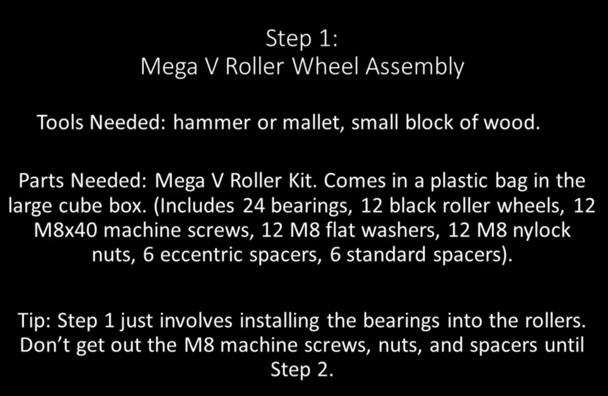
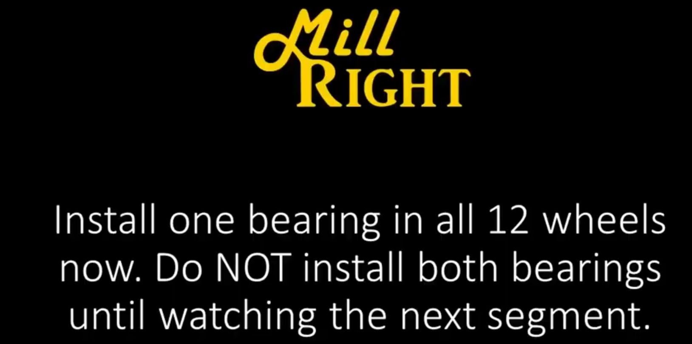
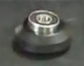
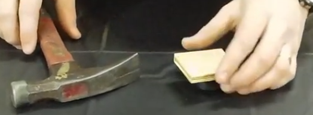
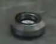

.. _Bearings:

Section 1: V-Wheel sub-assemblies
==================================

.. raw:: html

   <iframe width="853" height="480" src="https://www.youtube.com/embed/ZkZot-WJXo8?start=24" frameborder="0" allow="accelerometer; autoplay; encrypted-media; gyroscope; picture-in-picture" allowfullscreen></iframe>



V-Wheels are what allow the Gantry of the CNC to move in the X and Y directions along the extrusions.  This first section will describe how the wheel's are assembled.


Option 1: Derek’s Hammer Method
-------------------------------

YouTube Bookmark: https://youtu.be/ZkZot-WJXo8?t=24

In the video, Derek give’s us all a fine demonstration of the time honored American tradition
of “Redneck Engineering” leveraging a block of wood and a hammer as the most minimal set of
tools required to get bearings into a v-wheel.  

Section 1a: Supplies needed
```````````````````````````
#.  Parts Needed:

    #. V-Wheel (12)

    #. Bearings (24)

    #. M8 flat washer (12)

#.  Tools Needed:

    #. A small square of wood (3”x3” or larger should be fine and 1/2” thick just to be safe)

    #. 1 hammer or an arbor press or a drill press

    #. A sturdy surface that can survive a beating (The author don’t suggest the dining room table unless you don’t fear your spouse killing you)

Section 1b: Install the first bearing per V-Wheel
`````````````````````````````````````````````````
YouTube Bookmark: https://youtu.be/ZkZot-WJXo8?t=82



These steps will need to be repeated for all 12 V-Wheels

1.  Lay the V-Wheel flat on the surface

2.  Place a bearing on the opening of the V-Wheel being careful to center it



3.  Place the block of wood on the bearing

4.  Strike the wood firmly trying to hit above where the center of the bearing is



.. important:: You are not trying to pound the bearing to the center of the earth.
   This isn’t hammering a spike into concrete, think tapping in a finishing nail.
   If you hammer it like you are swinging a sledge hammer you can destroy both the
   bearing and the V-wheel.

5. Repeat this step for the remaining 11 wheels

Section 1c: Finish the V-Wheel sub-assembly
```````````````````````````````````````````
YouTube Bookmark: https://youtu.be/ZkZot-WJXo8?t=105

Now that the first bearing is seated in the 2 V-Wheels and you have a good sense of how hard
to hit the bearings with the hammer its time to finish out the V-Wheel sub-assembly.

1. Flip over the V-Wheel so the side without a bearing is facing up.



2. Place an M8 flat washer inside the V-Wheel.

.. important:: You must have this washer in between the 2 bearings to ensure the V-Wheels can roll correctly.  Don’t forget it!

3. Repeat this step for the remaining 11 wheels


Option 2: Use a Drill Press or arbor press
------------------------------------------
This was a suggestion from the MillRight CNC Facebook group.  In industry, bearings are press fit into
their sub-assembles via a tool called an Arbor press. If your home workshop is well supplied you may
already have one as a basic one comes in handy for automotive repairs.  While not as good as a dedicated
Arbor press a Drill Press can be lowered with enough torque to serve the same purpose.  If you don’t
have either the author recommends you update your birthday/holiday wish list or make friends with people
who have better tools!

Section 1d: Supplies needed
```````````````````````````

#.  Parts Needed:

    #. V-Wheel (12)

    #. Bearings (24)

    #. M8 flat washer (12)

#.  Tools Needed:

    #. 2 small square of wood (3”x3” or larger should be fine and 1/2” thick just to be safe)

    #. 1 Arbor press or a drill press

.. note:: Harbor Freight sells a basic 1 ton press https://www.harborfreight.com/1-ton-arbor-press-3552.html

Section 1e: Install the first bearing per V-Wheel
`````````````````````````````````````````````````

1. Clamp down a piece of wood to the base of the press to give a flat surface

2. Lay the V-Wheel flat on the bed of the arbor or drill press.

3. Place a V-Wheel on the bed

4. Place a bearing on the opening of the V-Wheel being careful to center it

5. Gently lower the chuck and align the bearing center under the chuck. Use a pencil or tape to mark where the V-Wheel is.  This makes it much easier to repeat 24 times

6. Back off the chuck an inch or 2

7. Place the block of wood on the bearing

8. Lower the arbor/drill press chuck onto the wood

9. Pull down and either kind of press should slide the bearing into the V-Wheel like buttah!

10. Repeat this step for the remaining 11 wheels

Section 1f: Finish the V-Wheel sub-assembly
```````````````````````````````````````````

Now that the first bearing is seated in the 2 V-Wheels and you have a good sense of how hard to hit
the bearings with the hammer its time to finish out the V-Wheel sub-assembly.

1. Flip over the V-Wheel so the side without a bearing is facing up.

2. Drop in an M8 flat washer inside the V-Wheel.  It's ok if the washer isn’t perfectly aligned with the hole in the bearing.  You can fix it later with the Allen key/screwdriver from the tools list

.. note:: You must have the M8 washer in between the 2 bearings to ensure the V-Wheels can roll correctly.  Don’t forget it!

3. Put the V-Wheel on your mark on the press

4. Place a bearing on the opening of the V-Wheel being careful to center it

5. Place the block of wood on the bearing

6. Lower the arbor/drill press chuck

7. Pull down and either kind of press should slide the bearing into the V-Wheel like buttah again

    * Optionally cringe at the fact that a Yankee is authoring the manual for a Southerner's CNC machine

8. Repeat this step for the remaining 11 wheels
