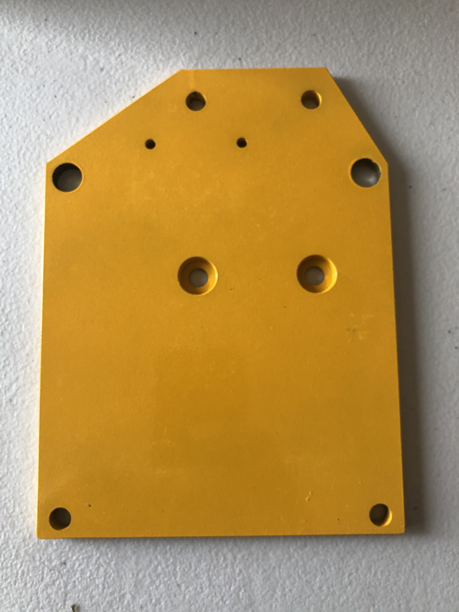

Section 2: Create the gantry plate sub-assemblies
=================================================

.. raw:: html

   <iframe width="853" height="480" src="https://www.youtube.com/embed/ZkZot-WJXo8?start=185" frameborder="0" allow="accelerometer; autoplay; encrypted-media; gyroscope; picture-in-picture" allowfullscreen></iframe>


Section 2a: Supplies needed
```````````````````````````
#.  Parts Needed:

    #. Left Gantry Plate

    #. Right Gantry Plate

    #. X Gantry Plate

    #. V-Wheel Sub-Assembly (4)

    #. M8x40mm machine screw (4)

    #. M8 Nylock Nuts (4)

    #. Eccentric Spacers (2)

    #. Fixed Spacers (2)

#.  Tools Needed:

    #. #2 or #3 Phillips head screwdriver
    #. 13mm wrench or 13mm socket+ratchet, or adjustable wrench
    #. A small Allen key or thin screwdriver

Section 2b: Notes before beginning
``````````````````````````````````
YouTube Bookmark: https://youtu.be/ZkZot-WJXo8?t=189

.. note:: Gantry plates have sides to them. For the Left and Right Gantry plates there are 2 holes just above
         the center of each plate.  On one side of the plate will be a pocket wider than the hole going full penetration.
         This is the side the V-Wheels are installed on.  ** DO NOT ** install the V-Wheels on the side without the pocket or
         you’ll be redoing your work.

.. note:: The tops of the Left and right and right gantry plates have the hex slopes to them and the bottom side is square

.. note:: In any mechanical device that will undergo vibration it is a good idea to use loktite on each
          screw to glue it in place and lesson the chance of it working it's way loose over time.  Only use BLUE
          loktite https://www.amazon.com/Loctite-QuickStix-442-37684-Thread-Treatment/dp/B000132VH6 on the Mega V’s screws.
          Red requires a torch to break its bond and you will just strip out the screws trying to remove them.  In the video
          Derek instructs you to loosely secure all the components of the gantry plate first.  We don’t recommend using loktite
          until you are ready for final tightening or you may have it dry and bind the screw before you are ready for final tightening.

Section 2c - Left and Right Gantry Plate Assembly
`````````````````````````````````````````````````

YouTube Bookmark: https://youtu.be/ZkZot-WJXo8?t=244

The following steps will be repeated for both the left and right Gantry plates.  Please use these pictures to help identify which is which in your build.




.. table::

    +------------------+--------------------+
    | Left Gantry Plate| Right Gantry Plate |
    +==================+====================+
    | |left|           + |right|            |
    +------------------+--------------------+


1. Gather the 2 eccentric spacers and rotate them so the thinner edge is facing up.  This is also call the * loose side *


2. With a pen mark the top part of the hex above the thinner portion.  Later when tuning the machine this will help you with knowing how tight the eccentrics are.


2. Starting from the top corner of Right Gantry plate insert the M8 screw through the plate such that the head is on the side without the pocket

3. Take an eccentric spacer and slide it over the screw shaft.


4. Slide the V-Wheel onto the shaft.  

.. note::  If the V-Wheel won’t fully engage the screw shaft it is likely that the washer between the bearings inside the V-Wheel is not aligned.  Take a small allen key or thin screwdriver and slide it into the hole in the V-Wheel and push on the washer until it is properly aligned to the hole

5. Spin the V-wheel until it is all the way down to the eccentric spacer

6. Put a M8 Nylock nut on the screw finger tight

7. Repeat these steps 1-5 for the other top side hole

8. For the Bottom 2 holes the process is the same but use the straight spacers and not the eccentric

.. image:: section2c_spacer_on_shaft.png
   :width: 50%

9. Put the 13mm wrench over the nylock nut and use the Phillips head screwdriver to tighten the V-wheel
   
.. note::  1) MillRight does not publish torque ratings for tightness
           2) After tightening the 8 Nylock nut the V-Wheel should spin with just slight resistance.  If you can’t rotate the wheel you have over tightened the nut.
           3) A trick I do is to use calipers to verify each M8 screw is the same final tightness <TODO ADD PIC>

10. Repeat steps 1-8 for the Left Gantry Plate


.. |left2| image:: section2c_left_gantry_plate_done.jpg
   :width: 50%


.. table::  The Completed Left and Right Gantry Plates

    +------------------+--------------------+
    | Left Gantry Plate| Right Gantry Plate |
    +==================+====================+
    | |left2|          | |right2|           |
    +------------------+--------------------+

Section 2d: Creating the X-Gantry Plate Sub-Assembly
````````````````````````````````````````````````````

YouTube Bookmark: https://youtu.be/ZkZot-WJXo8?t=452


.. important:: Reminder again that the V-Wheels go on the side OPPOSITE of the pockets for the X-plate and up is towards the notch


1. Starting from the top corner of Right Gantry plate insert the M8 screw through the plate such that the head is on the side **WITH** the pocket

2. Take an eccentric spacer and slide it over the screw shaft.

3. Slide the V-Wheel onto the shaft.  
.. note::  If the V-Wheel won’t fully engage the screw shaft it is likely that the washer between the bearings inside the V-Wheel is not aligned.  Take a small allen key or thin screwdriver and slide it into the hole in the V-Wheel and push on the washer until it is properly aligned to the hole

4. Spin the V-wheel until it is all the way down to the eccentric spacer

5. Put a M8 Nylock nut on the screw finger tight

6. Repeat these steps 1-5 for the other top side hole

7. For the Bottom 2 holes the process is the same but use the straight spacers and not the eccentric

8. Put the 13mm wrench over the nylock nut and use the Phillips head screwdriver to tighten the V-wheel

.. note::  1) MillRight does not publish torque ratings for tightness
           2) After tightening the M8 Nylock nut the V-Wheel should spin with just slight resistance.  If you can’t rotate the wheel you have over tightened the nut.
           3) Due to the screw head being seated in the pocket you will have to turn the screw more than you did for the Left and Right gantry screws.  The V-Wheels should have the same resistance when tightened as on the Left and Right Gantry plates
           4) Use calipers to verify each M8 screw is the same tightness


   The completed X-Gantry Sub-Assembly

