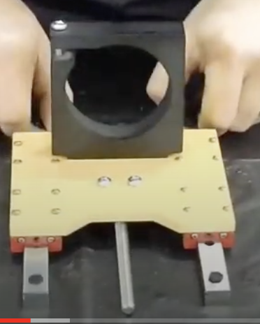

Section 3:  Z-Axis Assembly
===========================

.. raw:: html

   <iframe width="853" height="480" src="https://www.youtube.com/embed/ZkZot-WJXo8?start=648" frameborder="0" allow="accelerometer; autoplay; encrypted-media; gyroscope; picture-in-picture" allowfullscreen></iframe>

.. figure:: Section3_start.png
   :width: 80%


Section 3a: Supplies needed
---------------------------
#.  Parts Needed:

    #. Z Plate (1) 
    
    #. Z linear bearing rails (2)

       ..  warning:: Do not remove the plugs at the ends of the rails until instructed to.

    #. Router mount (1)

    #. Lead Screw (1)

    #. Anti-backlash nut (1)

    #. M3 x 10 Button Cap screws (16) or (14) if installing homing bracket

    #. M5 x 20 Machine Screws (2)

    #. M3 x 16 Machine Screws (2)
    
       * Only needed if you are installing homing switches.  Screws come from the homing kit bag

    #. Homing bracket (1) 
       
       * Only needed if you are installing homing switches.  Screws come from the homing kit bag

#.  Tools Needed:

    #. 2.5mm hex key for m3 button cap screws

    #. 4mm hex key for the M5 screws

    #. Needle Nose Pliers or 8mm wrench or adjustable wrench

Section 3b: Lead screw sub-assembly
-----------------------------------

YouTube Bookmark: https://youtu.be/ZkZot-WJXo8?t=932

There is a lock nut in the anti-backlash nut as well as a grub screw.  The grub screw controls how much 
resistance the anti-backlash nut will impose as the lead screw is turned. The lock nut is then tightened 
to fix the resistance level in place.

.. image:: section3b_lead_screw_complete.png
   :width: 50%

1. Take the lead screw and screw the anti-backlash nut down the screw shaft until it is about centered

.. warning:: An overly tight anti-backlash nut is a common source of problems in Z-Axis movement

2. Hold the anti-backlash nut in one hand and insert an Allen key into the lead screws base.

3. While Derek doesn’t provide torque ratings he does state that you should not have to strain to
   turn the lead screw but you should feel a little resistance.  If you shake the assembly the lead 
   screw shouldn’t feel sloppy i.e. shake around in the socket.

4.  Once you have the grub screw at the right level of level of tightness use the needle nose pliers 
    to tighten up the locking nut an lock the grub screw in place. 

Section 3c: The Linear Rails
----------------------------
The 2 linear rails that will be used in the Z-Axis assembly are a critical part of having quality cuts when completed. Some users, including the 
author, had extensive problems with their linear rails.  On the upside with a bit of elbow grease and A LOT of patience if you have problematic 
rails you can fixing them.  You are going to want to assembly the Z-plate in stages and test constantly to ensure nothing binds.  As you tighten screws you can go from good to bad in no time.

.. warning::  Bearings can fall out if you take the bearing blocks off the rails.  If it happens and you loose even one the block is toast.


Section 3c: Binding Check: Naked Linear rails and bearing blocks
````````````````````````````````````````````````````````````````

1.  Pick up a rail

2.  Ensure the rubber plugs are on both ends

3.  Grasp the bottom of the rail and tilt it vertically

4.  Slide the bearing block to just below the top rubber plugs.  Pay attention to how it moves.  It should slide easily with no crunching or binding.

5.  Let the block go.  It should fall under its own weight and hit your hand at the bottom. It may need a tiny nudge to get started.  DON'T let it go without your hand to stop it or your day will be ruined looking for bearings.

6.  If it binds while falling you will want to slide the block by hand at the point it binds and see if it feels wrong.


With one of my rails it was binding so badly it was hard to move either of the blocks on the rail by hand.  If things are binding at this
point it means the you have some work cut out for you.  

1.  Read the posts in this thread and watch all the videos: https://www.facebook.com/groups/1006388983068312/permalink/1164340013939874/

2.  Watch this YouTube video: https://www.youtube.com/watch?v=c53sa46C1qQ

3.  Then read the posts in this thread: https://www.facebook.com/groups/1006388983068312/permalink/1173701546337054/


Section 3c: Loosen the rail sweeps
``````````````````````````````````

At the end of each bearing block are 2 phillips head screws.  Sometimes the factory will over tighten these and warp the plastic which can bind on the rail.

1.  Loosen the screws a few turns on just one sidebar

2.  Slide the bearing block up and down the rail.  If it is now smooth don't touch the other sides screws.

3.  If still binding, loosen the other 2 screws, and repeat the sliding check.

4.  If that works give a moment of thanks for the simple solution. If it fails emit your favorite profanity.

5.  Repeat 1-4 for the other bearing block on the rail 

If the bearing blocks are now moving smoothly then proceed onto the next section.


Section 3c: If it moves use lube
````````````````````````````````

The bearings are packed with lube of questionable value at the factory.  It can be the cause of the binding so we need to address it.

1.  This YouTube video is long and a bit painful but it goes into extreme detail on what I'm going to describe.  https://www.youtube.com/watch?v=loBHYcifzRM&t=375s

2.  Get 3-in-1 oil https://www.homedepot.com/p/3-IN-ONE-4-oz-Fast-Acting-Penetrant-Drip-Oil-120015/300719551 

3.  Flip over the rail so you can see the underside of the blocks 

4.  Put a generous squirt of oil up each side of the bearing block where it grips the rail

5.  Slide the bearing block vigorously up and down the rail to work the oil in.

6.  If it is now smooth, be thankful and move on to Section 3d.

Regularly applying 3-in-1 to the bearings will keep things smooth.  Several users have reported they add a drop before each run and have had no recurring issues.


Section 3c: Clean out the gunk
``````````````````````````````

.. warning::  If you do this step wrong you will wreck your bearings.  Don't rush it, this is a dangerous fix. 

1.  The earlier videos showed using a magnetic bowl for this.  I went with a large paper bowl

2.  Put the rail in the bowl

3.  Remove the rubber plug from the end of the rail

4.  Position the bearing block so the 2 tracks gripping the rail are facing up and the block is horizontal

3.  VERY VERY VERY slowly slide the bearing block off of the rail. 

4.  Pay careful attention as th bearings become visible

5.  If any fall out STOP IMMEDIATELY and carefully put it back inside the retention clip

6.  Once the block is totally off the rail place it at the bottom of the bowl

7.  Pour enough cleaning agent to just cover the bearings into the bowl.  I used 99% rubbing alcohol, others have used brake cleaner.  Wear gloves if you are using anything toxic as a cleaner.

8.  Let the block soak for 10 minutes

9.  Take a toothpick or other smooth thin non-scratchy item and very carefully rotate the bearings in the track.

10.  You should see grease and potentially debris coming out.  Rotate the bearings through multiple cycles to work the degreaser through and go till it stops flushing
     At this point the bottom of my bowl was full of metal debris!   

11.  If any bearings fell out replace them on the track.

12.  Repeat 9-11 the other track on the block

13.  If while circulating the bearings you noticed a spot they consistently bind you can use a super thin flat head screwdriver to push out the track at that spot.  Think 0.1mm of push.  This is a tiny adjustment. 
     Repeat for any other spots that bind

14.  Very carefully slide the bearing block back on the rail


Section 3c: More lube
`````````````````````

Lube choice is a highly personal decision and the author won't judge you...out loud.  The author went with WD-40 White Lithium Grease https://www.homedepot.com/p/WD-40-SPECIALIST-10-oz-White-Lithium-Grease-30061/311360785.

1.  If you look at the red sweeper plates at the ends of the bearing block there is a small grease gun nib between the 2 screws. 

2.  Put the straw nozzle of the grease against the nib 

3.  Take a wad of paper towels and cover the block and over where your straw is attached to the nib.  

4.  Shoot the white lithium grease into the nib until you see it gush out.  I did very light pressure on the trigger so it trickled out of the can.

5.  Slide the block back and forth to work out the excess grease and clean it with the paper towels.  You want it lubed not dripping all over.

6.  The author then added a few drops of 3-in-1 penentrating oil for extra slipperiness

At this point the bearing block was sliding as smoothly as buttah!  

If it still isn't moving after all of this, it is time to contact customer support and see if they will do a replacement for you.


Section 3c: Check the rails
```````````````````````````

After the lube operation the author's blocks were still binding.  A careful study of the rail that was binding, deep scratches were 
found on the rail as well as burrs on the screwholes in the rail.

To deburr the holes I took a cone shaped dremel bit https://www.homedepot.com/p/Dremel-3-8-in-Rotary-Tool-Aluminum-Oxide-Arch-Shaped-General-Purpose-Grinding-Stone-952/100531940 in hand, inserted it in each hold and manually twisted it a few times.  

To buff out the scratches:

1. Took a dremel with a linen buffing disk attached

2.  Wet the disk with water

3.  Applied a tiny drop of toothpaste to each scratches

4.  Put on eye protection

5.  Turned on the dremel and buffed out the scratches.  

When I was done with this I had no more binding and the rails slid with ease


Section 3d:  Z-plate sub-assembly
---------------------------------

YouTube Bookmark:  https://youtu.be/ZkZot-WJXo8?t=651

.. note::  1) The 2 linear bearing rails have black or red plugs on each end.  This is to prevent the block from 
              sliding off the shaft and all the bearings falling out.  Leave the plugs in until a later step.
           2) The Z plate unlike the gantry plates is symmetrical so it doesn’t matter which side you screw the parts to.
           3) Don’t use loktite on any of the button cap screws now.  Wait until the X Plate assembly step


Section 3d: Option 1 - You DIDN'T buy homing switches
`````````````````````````````````````````````````````
.. todo::  get a picture of the Z-Plate without the homing bracket on it

.. note:  Use a machinist square to verify your Z-Plate isn't warped.

1. Lay out the 2 rails roughly the width of the Z-Plate

2. Lay the Z-plate on top of the bearing blocks 

3. Line up the 4 bearing blocks to the holes in the Z-Plate

4. Screw in the 4 button cap screws to one bearing block with the 2mm hex key untiRel the screw head just starts binding. Reminder don’t loktite them at this time

5. Slide the rail up and down and make sure there is no binding.  If there is loosen your screws a tiny bit and repeat.

6.  If there is still binding try flipping the rail 180 degree's as well as swapping to the other side.  If your plate is square and you had no binding before mounting you will be able to make this work.

7.  Repeat step 4-6 for each of the remaining 3 bearing block. 

8.  For the bearing block that would be in the upper right,  Do not screw in the 2 that would be on the second row from the top on the right

9.  Align the homing bracket to the 2 remaining screw holes

10.  Screw in the homing bracket with 2 of the m3x16mm machine screws with a small phillips head screwdriver


Section 3e: Join the lead screw to the Z-Plate
----------------------------------------------
.. image:: section3d_anti_backlash_on_plate.png
   :width: 30%

YouTube Bookmark:  https://youtu.be/ZkZot-WJXo8?t=1013

.. important::  Keep the 4 rubber plugs in the ends of the linear rails still so the bearings don’t fall apart on you

1. Tilt up the Z-Plate so that the top edge is facing up at your ceiling

2. Position the anti-backlash sub-assembly between the 2 linear rails with the 2 nylock nuts facing away from the Z-plate and the grub screw facing towards the bottom of the Z-Plate

3. Take 2 M5-20mm screw and pass them through the Z-Plate and through the anti-backlash nut then into the nylock nuts

4. Tighten the screws enough to hold the anti-backlash nut in place but you want to still be able to wiggle it a bit which will help when aligning up the Z-Drive System in a later step.

.. warning: If these 2 screws come loose later you will have issues with the Z-Axis slipping while cutting.   A write up on this issue is at this link https://www.facebook.com/groups/1006388983068312/permalink/1170572293316646/


Section 3f: Attach the router mount
-----------------------------------


YouTube Bookmark:  https://youtu.be/ZkZot-WJXo8?t=1013

.. sidebar:: Squaring the router plate

    Some router mounts shipped with improperly squares attachment surfaces and will require correction. A machinists square is a 
    fantastic tool for testing how true to 90 degrees the mount is.  The following 2 pictures courtesy of John Greene’s posts on Facebook show what a 
    non-squared mount will look like when tested.  The author does want to note that their router mount was properly squared on arrival.


   .. image:: section_3e_nonsquared_router1.png
      :width: 50%

   .. image:: section_3e_nonsquared_router2.png
      :width: 50%

   Option 1 - filing the mount
   If your mount isn’t square and you have access to fine metal files its is possible to very carefully shave down the block until it tests out as square when compared to a machinist 
   square.  This takes a steady hand and a lot of patience but it can yield a good result.

   Option 2 - machining the mount
   If you happen to have access to a milling machine or another CNC that is stiff enough to cut aluminum accurately then you can easily shave off a few mills of metal to square off 
   the block.  The following image is from John Greene and shows how he did it:

   .. image:: section_3e_filed_mount.png
      :width: 50%

   Option 3 - Shimming the mount
   Folded aluminium foil makes an excellent shim material.  Standard household foil is 0.016mm (0.63mils) thick and heavy duty is 0.024mm (94mils).  

   Shim stock is the more professional version of aluminum foil and can be purchased in a variety of thicknesses from places like McMaster-Carr https://www.mcmaster.com/shim-stock

   Feeler gauges can be used to determine thickness of the gap and then it is just a matter of using an appropriate supply of shim to use as a spacer between the mount and the Z-Plate.  
   If you are doing this solution with foil make sure you really compress each folded later Ideally firmly to get a consistent thickness.  It may take multiple attempts to get the right 
   thickness shim but this is a common technique for fixing squaring problems in hobby grade CNCs.  

   Option 4 - Table saw
   Using a table saw that has been properly squared and has a metal cutting blade can be used to trim off the end.  If you do this be careful for your work holding and your fingers.
   You only have 10, and a CNC machine isn't a good reason to chop off one even if it would make for a good story at the bar.

   The following is a properly squared router plate in an image posted by John Greene:

   .. image:: section_3e_properly_squared_mount.png
      :width: 50%


Section 3f: Option 1 - The default way of attaching the router plate
````````````````````````````````````````````````````````````````````
1. If the included screws on the router mount are M4x14mm then just use those and the locking washers.  If they measure M4x12mm then retain the locking washers but replace the screws 
   with 2 you sources that are at least 14mm in length.  

.. note::   Derek slips in the video and says multiple size and length screws in his overlay.

2. The router plate will obstruct 4 of the lower and inner m3 button cap screws when attached.  Test align the plate to identify the offending screws and tighten then to their final torque.  
   Apply loktite to them at this point.

3. Pass the 2 screws through the router plate such that they exit on the side without the linear rails.

4. If the holes are too full of powder coating you can gently tap the screw through the hole or use a reamer to clear out the excess

5. Slide the 2 M4x14mm screws into the router plate and tighten it.  

6. Test the plate for square and correct via any of the discussed techniques.

7. Once you feel good about the squareness undo the 2 screws, apply loktite and secure them tightly.

8. Retest for squareness to make sure you didn’t mess anything up


.. _Brad:

Section 3f: Option 2 - Using Brad Ellerbroek tramming plate modification. 
`````````````````````````````````````````````````````````````````````````

.. MillRight CNC Mega V Facebook Group 

In a post to the `MillRight CNC Mega V Facebook Group <https://www.facebook.com/groups/1006388983068312/permalink/1133958160311393/>`_
Brad Ellerbroek announced he had designed an aluminum plate to simplify the process of squaring the router mount and ultimately simplifying tramming.
If you purchase the plate from Brad it comes with very complete `documentation <https://drive.google.com/file/d/1Yc8Sr-U3OkEkd9rxo0iw7StomRTyWeDM/view?fbclid=IwAR23EVRFDl58d-2futrkE14Ie2B--xgnSa6sh4fzu9QVPtIpOv3tr89NjWU>`_ 
on how to install it on the router plate.  If you feel like cutting one yourself, he posted the Fusion 360 file on `Google Drive <https://drive.google.com/file/d/1IqCz4tO2tKrhN-R_FnJYufnnnhnSeFPm/view?usp=sharing&fbclid=IwAR2W5TqoOcIO-L5jHB9g2feQnZWXAxpV644OAtw-JIP0fDhq5IsZnC7ixkE>`_.

.. image:: section_3e_brads_plate1.png
   :width: 50%

.. image:: section_3e_brads_plate2.png
   :width: 50%


