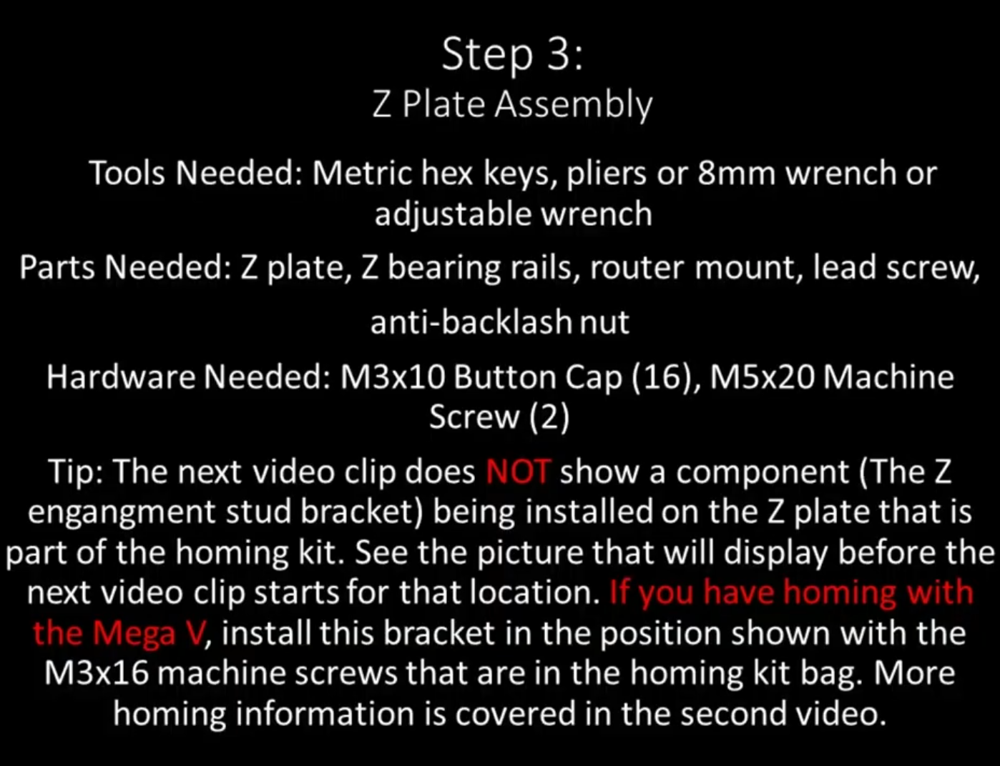
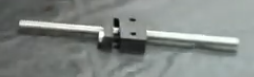
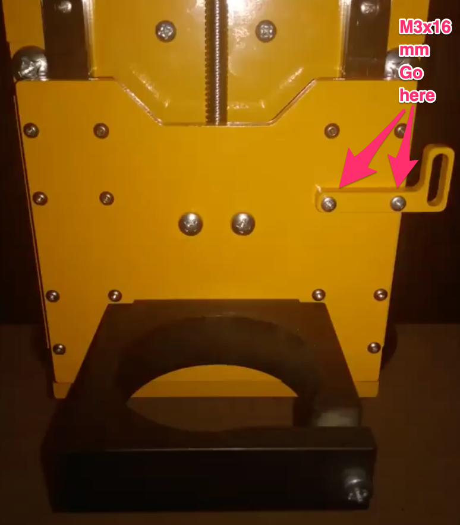
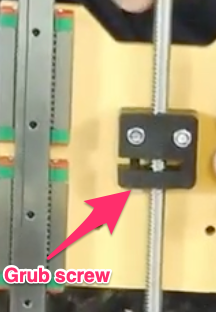
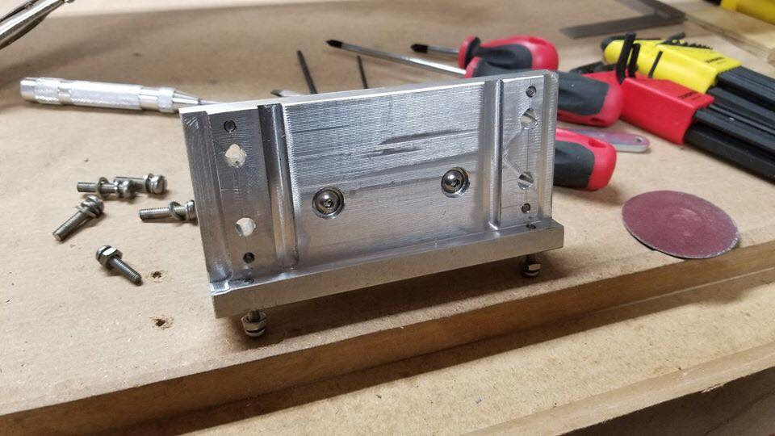
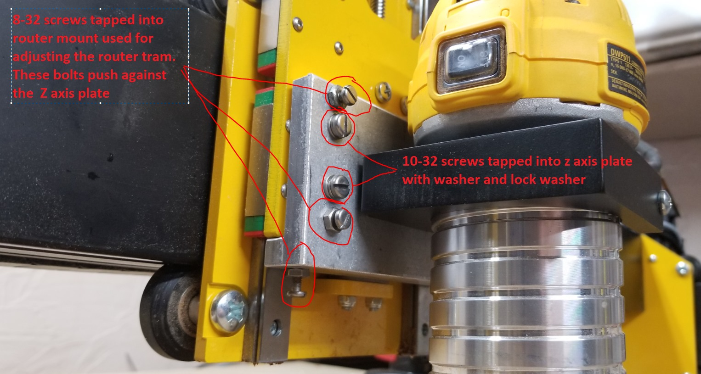

Section 3:  Z-Axis Assembly
===========================

.. raw:: html

   <iframe width="853" height="480" src="https://www.youtube.com/embed/ZkZot-WJXo8?start=648" frameborder="0" allow="accelerometer; autoplay; encrypted-media; gyroscope; picture-in-picture" allowfullscreen></iframe>




Section 3a: Supplies needed
---------------------------
#.  Parts Needed:

    #. Z Plate (1) 
    
    #. Z linear bearing rails (2)

    #. Router mount (1)

    #. Lead Screw (1)

    #. Anti-backlash nut (1)

    #. M3 x 10 Button Cap screws (16) or (14) if installing homing bracket

    #. M5 x 20 Machine Screws (2)

    #. M3 x 16 Machine Screws (2)
    
       * Only needed if you are installing homing switches.  Screws come from the homing kit bag

    #. Homing bracket (1) 
       
       * Only needed if you are installing homing switches.  Screws come from the homing kit bag

#.  Tools Needed:

    #. 2.5mm hex key for m3 button cap screws

    #. 4mm hex key for the M5 screws

    #. Needle Nose Pliers or 8mm wrench or adjustable wrench


Section 3b: lead screw sub-assembly
-----------------------------------

YouTube Bookmark: https://youtu.be/ZkZot-WJXo8?t=932

There is a lock nut in the anti-backlash nut as well as a grub screw.  The grub screw controls how much 
resistance the anti-backlash nut will impose as the lead screw is turned. The lock nut is then tightened 
to fix the resistance level in place.



1. Take the lead screw and screw the anti-backlash nut down the screw shaft until it is about centered

.. warning:: An overly tight anti-backlash nut is a common source of problems in Z-Axis movement

2. Hold the anti-backlash nut in one hand and insert an Allen key into the lead screws base.

3. While Derek doesn’t provide torque ratings he does state that you should not have to strain to
   turn the lead screw but you should feel a little resistance.  If you shake the assembly the lead 
   screw shouldn’t feel sloppy i.e. shake around in the socket.

4.  Once you have the grub screw at the right level of level of tightness use the needle nose pliers 
    to tighten up the locking nut an lock the grub screw in place. 


Section 3c:  Z-plate sub-assembly
---------------------------------

YouTube Bookmark:  https://youtu.be/ZkZot-WJXo8?t=918


.. note::  1) The 2 linear bearing rails have black or red plugs on each end.  This is to prevent the block from 
              sliding off the shaft and all the bearings falling out.  Leave the plugs in until a later step.
           2)  The Z plate unlike the gantry plates is symmetrical so it doesn’t matter which side you screw the parts to
           3) Don’t use loktite on any of the button cap screws now.  Wait until the X Plate assemble step


Section 3c: Option 1 - You DIDN'T buy homing switches
`````````````````````````````````````````````````````
.. todo::  get a picture of the Z-Plate without the homing bracket on it

1. Lay out the 2 rails roughly the width of the Z-Plate

2. Lay the Z-plate on top of the Linear rails 

3. Line up the 4 bearing blocks to the holes in the Z-Plate

4. Screw in the 16 button cap screws with the 2mm hex key making them only finger tight. Reminder don’t loktite them at this time


Section 3c: Option 2 - You DID buy homing switches
``````````````````````````````````````````````````


1. Lay out the 2 rails roughly the width of the Z-Plate

2. Lay the Z-plate on top of the Linear rails 

3. Face the notch in the Z plate away from you.  The notch will be considered the top of the plate

4. Line up the 4 bearing blocks to the holes in the Z-Plate

5. Screw in the 14 button cap screws with the 2mm hex key making them only finger tight. Do not screw in the 2 that would be on the second row from the top on the right

6. Align the homing bracket to the 2 remaining screw holes

7. Screw in the homing bracket with 2 of the m3x16mm machine screws with the 2mm Allen key


Section 3d: Join the lead screw to the Z-Plate
----------------------------------------------


YouTube Bookmark:  https://youtu.be/ZkZot-WJXo8?t=1013

.. important::  Keep the 4 rubber plugs in the ends of the linear rails still so the bearings don’t fall apart on you

1. Tilt up the Z-Plate so that the top edge is facing up at your ceiling

2. Position the anti-backlash sub-assembly between the 2 linear rails with the 2 nylock nuts facing away from the Z-plate and the grub screw facing towards the bottom of the Z-Plate

3. Take 2 M5-20mm screw and pass them through the Z-Plate and through the anti-backlash nut then into the nylock nuts

4. Tighten the screws enough to hold the anti-backlash nut in place but you want to still be able to wiggle it a bit which will help when aligning up the Z-Drive System in a later step.


Section 3e: Attach the router mount
-----------------------------------


YouTube Bookmark:  https://youtu.be/ZkZot-WJXo8?t=1013

.. sidebar:: Squaring the router plate

    Some router mounts shipped with improperly squares attachment surfaces and will require correction. A machinists square is a 
    fantastic tool for testing how true to 90 degrees the mount is.  The following 2 pictures courtesy of John Greene’s posts on Facebook show what a 
    non-squared mount will look like when tested.  The author does want to note that their router mount was properly squared on arrival.


   .. image:: section_3e_nonsquared_router1.png
      :width: 50%

   .. image:: section_3e_nonsquared_router2.png
      :width: 50%

   Option 1 - filing the mount
   If your mount isn’t square and you have access to fine metal files its is possible to very carefully shave down the block until it tests out as square when compared to a machinist 
   square.  This takes a steady hand and a lot of patience but it can yield a good result.

   Option 2 - machining the mount
   If you happen to have access to a milling machine or another CNC that is stiff enough to cut aluminum accurately then you can easily shave off a few mills of metal to square off 
   the block.  The following image is from John Greene and shows how he did it:

   .. image:: section_3e_filed_mount.png
      :width: 50%

   Option 3 - Shimming the mount
   Folded aluminium foil makes an excellent shim material.  Standard household foil is 0.016mm (0.63mils) thick and heavy duty is 0.024mm (94mils).  

   Shim stock is the more professional version of aluminum foil and can be purchased in a variety of thicknesses from places like McMaster-Carr https://www.mcmaster.com/shim-stock

   Feeler gauges can be used to determine thickness of the gap and then it is just a matter of using an appropriate supply of shim to use as a spacer between the mount and the Z-Plate.  
   If you are doing this solution with foil make sure you really compress each folded later Ideally firmly to get a consistent thickness.  It may take multiple attempts to get the right 
   thickness shim but this is a common technique for fixing squaring problems in hobby grade CNCs.  

   Option 4 - Table saw
   Using a table saw that has been properly squared and has a metal cutting blade can be used to trim off the end.  If you do this be careful for your work holding and your fingers.
   You only have 10, and a CNC machine isn't a good reason to chop off one even if it would make for a good story at the bar.

   The following is a properly squared router plate in an image posted by John Greene:

   .. image:: section_3e_properly_squared_mount.png
      :width: 50%


Section 3e: Option 1 - The default way of attaching the router plate
````````````````````````````````````````````````````````````````````
1. If the included screws on the router mount are M4x14mm then just use those and the locking washers.  If they measure M4x12mm then retain the locking washers but replace the screws 
   with 2 you sources that are at least 14mm in length.  

.. note::   Derek slips in the video and says multiple size and length screws in his overlay.

2. The router plate will obstruct 4 of the lower and inner m3 button cap screws when attached.  Test align the plate to identify the offending screws and tighten then to their final torque.  
   Apply loktite to them at this point.

3. Pass the 2 screws through the router plate such that they exit on the side without the linear rails.

4. If the holes are too full of powder coating you can gently tap the screw through the hole or use a reamer to clear out the excess

5. Slide the 2 M4x14mm screws into the router plate and tighten it.  

6. Test the plate for square and correct via any of the discussed techniques.

7. Once you feel good about the squareness undo the 2 screws, apply loktite and secure them tightly.

8. Retest for squareness to make sure you didn’t mess anything up


Section 3e: Option 2 - Using Brad Ellerbroek tramming plate modification. 
`````````````````````````````````````````````````````````````````````````

.. MillRight CNC Mega V Facebook Group 

In a post to the `MillRight CNC Mega V Facebook Group <https://www.facebook.com/groups/1006388983068312/permalink/1133958160311393/>`_
Brad Ellerbroek announced he had designed an aluminum plate to simplify the process of squaring the router mount and ultimately simplifying tramming.
If you purchase the plate from Brad it comes with very complete `documentation <https://drive.google.com/file/d/1Yc8Sr-U3OkEkd9rxo0iw7StomRTyWeDM/view?fbclid=IwAR23EVRFDl58d-2futrkE14Ie2B--xgnSa6sh4fzu9QVPtIpOv3tr89NjWU>`_ 
on how to install it on the router plate.  If you feel like cutting one yourself, he posted the Fusion 360 file on `Google Drive <https://drive.google.com/file/d/1IqCz4tO2tKrhN-R_FnJYufnnnhnSeFPm/view?usp=sharing&fbclid=IwAR2W5TqoOcIO-L5jHB9g2feQnZWXAxpV644OAtw-JIP0fDhq5IsZnC7ixkE>`_.






