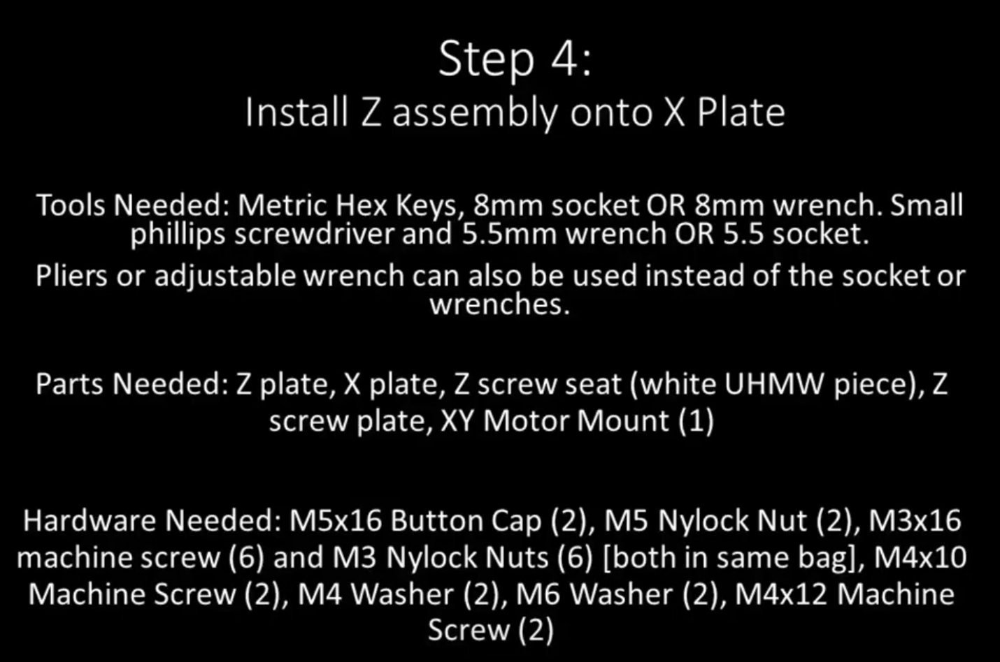
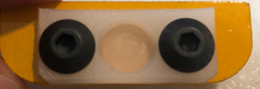
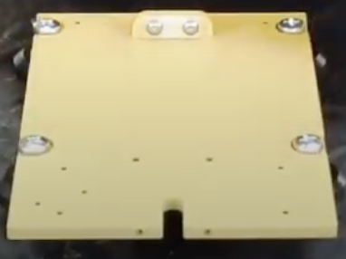
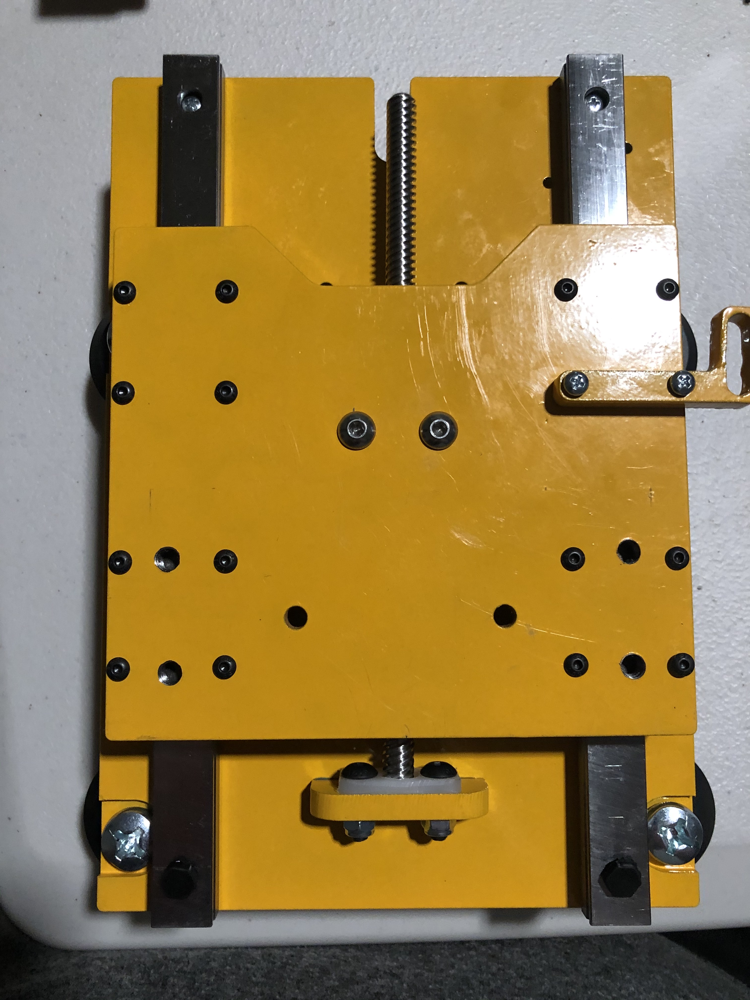
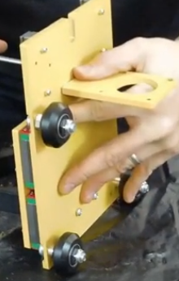

Section 4: Install the Z-Assembly onto the X-Plate
==================================================

.. raw:: html

   <iframe width="853" height="480" src="https://www.youtube.com/embed/ZkZot-WJXo8?start=1310" frameborder="0" allow="accelerometer; autoplay; encrypted-media; gyroscope; picture-in-picture" allowfullscreen></iframe>

Section 4a: Supplies needed
---------------------------
#.  Parts Needed:

    #. Z Plate sub-assembly (1) 
    
    #. X Plate sub-assembly (1)

    #. White UHMW plastic Z screw seat (1)

    #. Z Screw Plate (1)

    #. XY Motor Mount (1)

    #. M5x16mm Button cap screws (2)
    
       .. note:: My kit came with machine screws not button cap. The machine screws work fine

    #. M5 Nylock Nuts (2)
    
    #. M3x16mm machine screws (6)

    #. M3 Nylock Nuts (6)

    #. M4x10mm Machine Screws (2)

    #. M4 Nylock Washer (2)
       
       .. note:: These were missing from my kit, I used 2 of the M4 split locking washers that were in the kit
    
    #. 1. M6 Washer (2)

    #. M4x12mm Machine Screw (2)

#.  Tools Needed:

    #. 2.5mm key for M3 screws

    #. 3mm hex key for M4 screws

    #. 4mm hex key for the M5 screws

    #. 8mm wrench or 8mm socket wrench

    #. 5.5mm wrench or 5.5mm socket wrench or needle nose pliers 

    #. Small Phillips head screwdriver

Section 4b: Z-Screw seat sub-assembly
-------------------------------------

YouTube Bookmark: https://youtu.be/ZkZot-WJXo8?t=1326

The Z-Screw Seat will get mounted to the X-Plate and will ulitmately be where the bottom of the lead screw 
from section 3 will sit in its final position.  To assemble the seat do the follow:

1. Align the UHMW plastic Z screw seat plate with the indentation facing upend the 2 rounded corners facing the rounded corners of the steel plate to the steel Z screw plate

2. Pass 2 M5x16mm screws through the 2 plates

3. Secure the screws with the 2 M5 Nylock nuts.
    * Note in the video Derek shows a technique where he holds an 8mm socket in his hand as well as the loosely assembled part and then just uses a hex key to  cinch it all down and prevent it from getting crooked. https://youtu.be/ZkZot-WJXo8?t=1386
    
    ..  warning:: Do not over tighten the 2 screws as it will ballon out the plastic and damage the part.

Section 4c: Attaching the Z-Screw sub-assembly to the X-Plate
-------------------------------------------------------------

YouTube Bookmark: https://youtu.be/ZkZot-WJXo8?t=1431

1. Take 2 M4x10mm screws and put the nylock washers on them 

   .. note:: Note I was missing the nylock washers so I sourced regular `stainless m4 locking washers <https://www.homedepot.com/p/Everbilt-4-Piece-M4-Stainless-Steel-Metric-Lock-Washer-842408/204993667>`_ from Home Depot.

2. Pass each screw thru the X-Plate from the side with the V-Wheels to the side with the screw heads

3. Align the Z-Screw sub-assembly so the plastic piece is towards the top notch of the X-Plate

4. Optional: Put loktite on the 2 screws at this point

5. Secure the screws to the sub-assembly

6. Check the alignment for square with your machinist square once tightened

Section 4d:  Attaching the Z-Plate to the X-Plate
-------------------------------------------------

YouTube Bookmark: https://youtu.be/ZkZot-WJXo8?t=1535

1. Align the Z-Plate to the X-Plate such that the linear rails are on the side of the X-Plate with the screw heads and the notches on the X and Z plates are both facing the same direction

2. Remove the plugs from the tops of the linear rails.  
   .. note::  Using an Allen key as a pin pusher helps pop the plugs out.
   
   .. warning::  DO NOT tip over the Z plate and let the bearing blocks fall out or you will destroy your rails.

3. If the Z screw is too far down it won’t be able to  seat in the plastic pocket of the Z-Screw plate.  If this is the case, rotate the screw shaft until it is short enough to fit.

4. Line up the bearing rails to the screw holes in the X-Plate.

5. Take an M3x16mm machine screw and pass it through the hole in each rail you just removed the plugs from.

6. Carefully tilt up the X and Z Plates and attach an M3 Nylock nut to each screw loosely

   .. note::  M3 Nylock nuts are 5.5mm, if you don’t have this unusual size socket not in most basic sets just use a pair of needle nose pliers. 

7. Repeat steps 5 and 6 for the next 2 holes in the rails.  

   .. note::  The V-Wheel can make this set of screws a bit tricky.  Use a small head screw driver that seats well to avoid stripping the screws

Section 4e:  Attaching the Z-Motor Mount
----------------------------------------

YouTube Bookmark: https://youtu.be/ZkZot-WJXo8?t=1826

1. The motor mount will attach to the back of the X-Plate on the same side as the V-Wheels

2. Insert two M4x12mm screws through the X-Plate

3. Place an M6 Washer over each screw

   .. warning::   DO NOT forget the washers.  They are key to properly aligning the pinions and you’ll be really annoyed fixing it later
                  Be careful not to cross thread the screws as they go into the plate

4. Optionally apply loktite to the screws now

5. Ensure that the motorplate isn’t canted in either direction as you fasten it.  

6. After you get the screws loosely fastened, push down on the plate to ensure the screws are at the bottom of their free fitment

7. Verify it is square with your machinist square

8. Measure the distance from the bottom of the motor plate to the bottom of the Z Gantry plate on both sides. If its crooked then measurements won’t match
