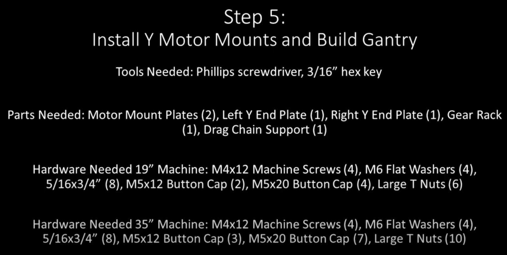
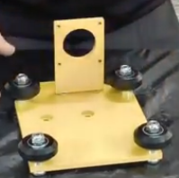
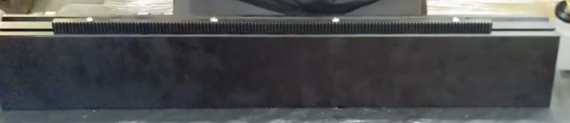
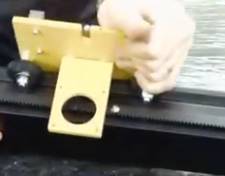
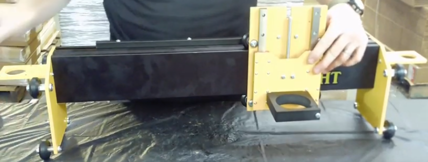
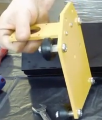
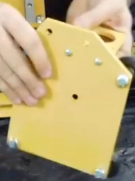

Section 5: Install Y Motor Mounts and Build the Gantry
======================================================

.. raw:: html

   <iframe width="853" height="480" src="https://www.youtube.com/embed/ZkZot-WJXo8?start=1947" frameborder="0" allow="accelerometer; autoplay; encrypted-media; gyroscope; picture-in-picture" allowfullscreen></iframe>

Section 5a: Supplies needed
---------------------------
#. Parts Needed (Common)

   #. Motor Mounts (2)

   #. Left Y End Plate (1)

   #. Right Y End Plate (1)

   #. Gear Rack (1)

   #. Drag Chain Support (1)

   #. M6 Flat Washers (4)

#. Parts Needed (19”)

   #. 5/16x3/4” (8)

   #. M5x12mm Button Cap Screws (2)
   
   #. M5x20mm Button Cap Screws (4)
   
   #. Large T Nuts (6)

#. Parts Needed (35”)

   #. M4x12 Machine Screws (4)

   #. 5/16x3/4” Button Cap Screws (8)

   #. M5x12mm Button Cap Screws (3)

   #. M5x20mm Button Cap Screws (7)

   #. Large T Nuts (10)

#. Tools Needed:

   #. #2 Phillips head screwdriver

   #. 3/16” hex key

Section 5b: Attaching the Y motor mount to the Left and right Gantry plates
---------------------------------------------------------------------------

YouTube Bookmark:  https://youtu.be/ZkZot-WJXo8?t=1951

1. The motor mount will attach to the back of the Y-Plates on the same side as the V-Wheels

2. Insert two M4x12mm screws through each of the Y-Plates

3. Place an M6 Washer over each screw

   .. warning:: 1) DO NOT forget the washers.  They are key to properly aligning the pinions and you’ll be really annoyed fixing it later
                2) Be careful not to cross thread the screw
   
   .. note::  One of the mounting plate m4x12mm screws will be blocked by the Gantry once its installed so be sure to secure in tightly now

4. Optionally apply loktite to the screws now

5. Ensure that the motorplate isn’t canted in either direction as you fasten it.  

6. After you get the screws loosely fastened, push down on the plate to ensure the screws are at the bottom of their free fitment

7. Verify it is square with your machinist square

8. Measure the  distance from the bottom of the motor plate to the bottom of the Y Gantry plate on both sides. If its crooked then measurements won’t match

9. Repeat for the other Y Plate

Section 5c: Attaching the gear rack to the gantry
-------------------------------------------------

YouTube Bookmark:  https://youtu.be/ZkZot-WJXo8?t=2057

.. note::  The front of the gantry is closet to the V groove and the rear is closer to the T Slot
           If your gantry shipped with the sticker on held on with masking tape now is a good time to apply it to the front face-off the gantry.  The author refuses to answer any questions on why they felt this note was needed and/or where the sticker not their unit may be located

1. Gather 1 of the 3 gear racks (toothed strips of metal)

2. For the 19” you will be using 4 T-Nuts and 4 M5x20mm

3. For the 35” you will be using 7 T-Nuts and 7 M5x20mm

4. Slip the screws thru the holes in the get rack.  

5. Loosely attach a T-Nut to each screw so it is just barely held on

6. Get the T Nuts all aligned in the same direction

7. Ensure that the teeth on the gear rack are facing the back side of the gantry and slide the T-Nuts into the T-Track on the Gantry and roughly center the gear rack onto the gantry. 

8. Loosely tighten all of the screws.  

9. Use a set of calipers or even a tape measure to ensure the gear rack is properly centered
    
   ..note:: The gear being crooked on the gantry will cause binding in the final assembly when jogging the router.  Getting the positioning even is key to a successful end result with all 3 gear racks.  Carefully measure the back of the gear rack to the front of the gantry at each screw and adjust as necessary for even spacing.
            Cinch down the screws but don’t loktite them yet

Section 5d: Attaching the X Plate to the gantry 
-----------------------------------------------

YouTube Bookmark:  https://youtu.be/ZkZot-WJXo8?t=2250

..  warning::  Be careful moving the X-Plate around.  You don’t want to tilt it and have the bearings fall off the rails

1. With the front of the gantry rail (sticker side) facing the front of the X-Plate (router mount side) slide the V-Slot onto the V-Wheels of the X-Plate

   .. note::  1) If your M8 Screws are too tight on the V Wheels you may not be able to slide onto the gantry V-Slot.  If this happens just loosen your M8 screws.
              2) If you have burrs at the openings of the track, which happened to some due to shipping damage, taking a file to smooth out the track opening is a good idea to protect the V-Wheels.

2. If your M8 screws were loose tighten them now

3. Fine grained tightening is done by taking an 8mm wrench and turning the eccentric spacers to add a bit more pressure on the wheels and rails

4. When done you should be able to smoothly slide the X-Plate up and down the Gantry.  If there is any binding check that each V-Wheel is of equal tightness

Section 5e: Attaching the left and Right Y-Plates to the gantry
---------------------------------------------------------------

YouTube Bookmark:  https://youtu.be/ZkZot-WJXo8?t=2333

.. note::  The Y-Gantry plates have sides to them.  The longer slope on the plate top should point towards the front of the gantry when the V-Wheels face away from the gantry 

.. table::

    +------------------+--------------------+
    | Left Gantry Plate| Right Gantry Plate |
    +==================+====================+
    | |left|           + |right|            |
    +------------------+--------------------+

1. Line up the Right Gantry Plate with the right side of the Gantry’s 4 pre-tapped holes

2. Optionally apply loktite to the 4 screws

3. Take 5/16”x3/4” Button cap screws and fasten the Right Gantry plate to the gantry finger tight
   .. warning::  You will likely be rotating the gantry to align things.  Be very careful the bearings don’t fall off the Z-Plate while doing this

4. Using a 5/16” socket gradually tighten each of the screws a little at a time to get them consistent and not can’t the plate.
   
   .. note::  The screws should go in smoothly, if they resist then something is wrong, back out and reseat the screw

5. Verify the plate is on square to the gantry

6. Turn the gantry so the back is facing you. 

   ..  warning::  When doing this don’t let your Z-Plate fall off

7. Pass an M5x12mm button cap screw through each hole (not slot) in the drag chain support and attach a T-Nut to each

8. Position the drag chain support on the back left side (opposite of the right gantry plate and slide the T-nuts into the T-Track.

   .. image:: section_5e_drag_chain_support.png
      :width: 75%

9. Slide the drag chain support just onto the T-Track staying very close to the end of the gantry

10. Secure the screws tightly to the T Nuts

11. Now its time to attach the Left Gantry plate

    .. image:: section_5e_attach_left_gantry.png
       :width: 75%

12. Just like the Right plate align the plate to the the predrilled holes in the gantry with the V-Wheels facing out

13. Optionally apply loktite to the 4 screws

14. Optionally supporting the end of the gantry with a block of wood makes it much easier to attach the Left plate and avoid any canting while cinching it down

15. Take 5/16”x3/4” Button cap screws and fasten the Right Gantry plate to the gantry finger tight
    
    ..warning::  You will likely be rotating the gantry to align things.  Be very careful the bearings don’t fall off the Z-Plate while doing this

16. Using a 5/16” socket gradually tighten each of the screws a little at a time to get them consistent and not can’t the plate.
   
    .. note::  The screws should go in smoothly, if they resist then something is wrong, back out and reseat the screw

17. Verify the plate is on square to the gantry

    .. warning::  1) At this point the gantry is now a wheeled vehicle, don’t let it drive off your work bench
                  2) Thegantry is now fairly heavy with the 3 plates attached.  Practice proper back/spine safety when moving it.  Remember kids a spine is a terrible thing to waste.