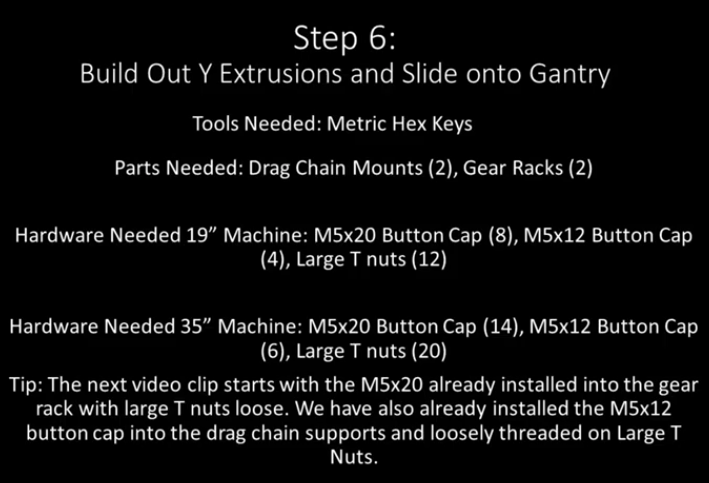
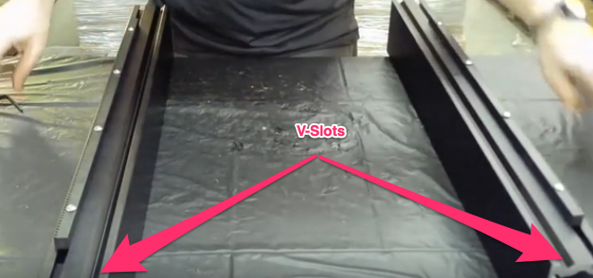
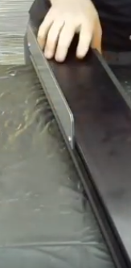
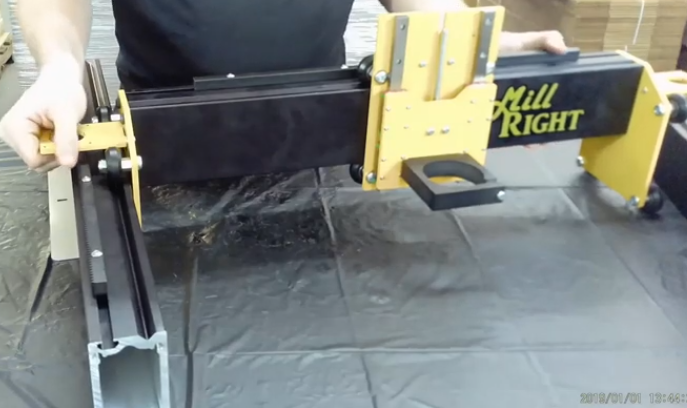

Section 6: Attach the Y-Rails to the Gantry
===========================================

.. raw:: html

   <iframe width="853" height="480" src="https://www.youtube.com/embed/ZkZot-WJXo8?start=2849" frameborder="0" allow="accelerometer; autoplay; encrypted-media; gyroscope; picture-in-picture" allowfullscreen></iframe>

Section 6a: Supplies needed
---------------------------
#. Parts Needed (Common)

   #. Gear Rack (2)
   #. Drag Chain Support (2)

#. Parts Needed (19”)

   #. 19” Rails (2)

   #. M5x12mm Button Cap Screws (4)

   #. M5x20mm Button Cap Screws (8)

   #. Large T Nuts (12)

#. Parts Needed (35”)

   #. 35” Rails (2)

   #. M5x12mm Button Cap Screws (6)

   #. M5x20mm Button Cap Screws (14)

   #. Large T Nuts (20)

#. Tools Needed:

   #. 4mm hex key for the M5 screws

Section 6b: Attach the gear racks to the 2 Y rail
-------------------------------------------------

YouTube Bookmark: https://youtu.be/ZkZot-WJXo8?t=2854

.. note::  The front of the rack is closet to the V groove and the rear is closer to the T Slot. The front will face into the working area of the machine

1. Gather 1 of the 3 gear racks (toothed strips of metal)

2. For the 19” you will be using 4 T-Nuts and 4 M5x20mm

3. For the 35” you will be using 7 T-Nuts and 7 M5x20mm

4. Slip the screws thru the holes in the gear rack.  

5. Loosely attach a T-Nut to each screw so it is just barely held on

6. Get the T Nuts all aligned in the same direction

7. Ensure that the Teeth on the gear rack are facing the back side of the gantry and slide the T-Nuts onto the rail. 

8. Loosely tighten all of the screws.  
   
   .. note:: Cinch down the screws just enough so you can just slide the rack but don’t loktite them yet the final positioning comes later

9. Repeat for the other rail

Section 6c: Attach the drag chain support
-----------------------------------------

YouTube Bookmark: https://youtu.be/ZkZot-WJXo8?t=2990

1. Pass an M5x12mm button cap screw through each hole (not slot) in the drag chain support and attach a T-Nut to each

2. Optionally use loktite on the screws

3. Turn the rail onto its side so that the t-track is now the side

4. Position the drag chain support on the back side of the rail so it is facing away from the work area 

5. Slide the support plate down to the T-Track until it is just on the rear side of the rail

6. Pull up on the drag chain support to have it extend as far away from the rail as it can

7. Secure the screws tightly to the T Nuts

Repeat for the other rail as shown in https://youtu.be/ZkZot-WJXo8?t=3084

Section 6d:  Slide the 2 rails onto the gantry
----------------------------------------------

YouTube Bookmark: https://youtu.be/ZkZot-WJXo8?t=3177

1. Lay out your gantry with the rails on the appropriate side

   .. warning:: The gantry can roll, be careful

2. Lift the left side of the gantry slightly and slide the left rail onto the V-Wheels

3. If needed loosen the eccentric spacer to make it slide more easily

4. Repeat for the right side rail

   .. image:: section_6d_done.png
      :width: 75%
