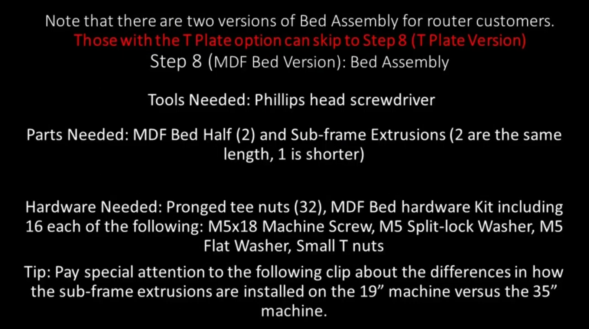
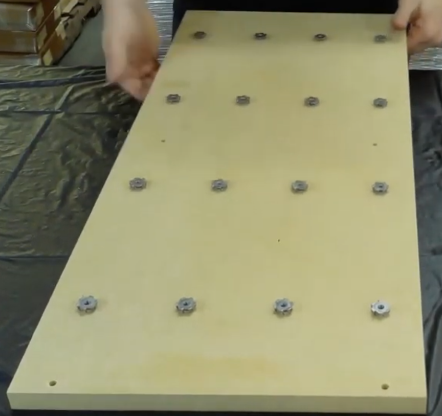
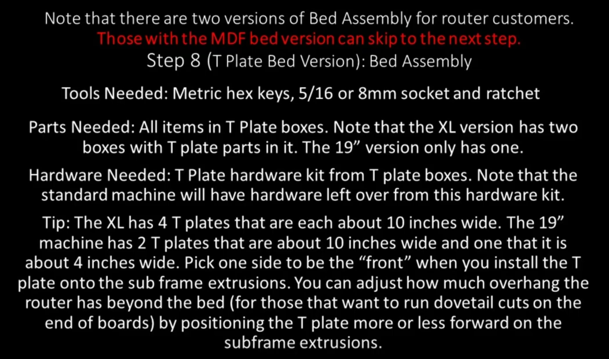

Section 8: Bed Assembly (MDF and T-Plate)
=========================================

.. raw:: html

   <iframe width="853" height="480" src="https://www.youtube.com/embed/jbYK1Pekhf0?start=3" frameborder="0" allow="accelerometer; autoplay; encrypted-media; gyroscope; picture-in-picture" allowfullscreen></iframe>

Section 8a: Supplies Needed (MDF)
---------------------------------
#. Parts Needed:

   #. MDF Half Bed (2)

   #. Long Sub Frame Extrusions (2)

   #. Short Sub-Frame Extrusion (1)

   #. Pronged T-Nuts (32)

   #. M5x18mm Machine Screws (16)

   #. M5 Split-lock Washer (16)

   #. M5 Flat Washer (16)

   #. Small T-Nuts (16)

#. Tools Needed:

   #. #2 Phillips head Screw Driver

   #. 4mm hex key

   #. A hammer

Section 8b:  Installing T-Nuts (MDF)
------------------------------------

YouTube Bookmark:  https://youtu.be/jbYK1Pekhf0?t=10

1. Lay out the 2 MDF sections so that the pockets are facing down

2. Insert the t-nuts into each of the holes that are in groups of 4

   .. warning:: Do not put T-nuts in the 2 holes at the edges of the MDF boards

3. Hit each t-nut with your hammer until it is flush with the board surface (This is great for working out anger)

Section 8c:  Installing the sub-frame extrusions (19”) (MDF)
------------------------------------------------------------

YouTube Bookmark:  https://youtu.be/jbYK1Pekhf0?t=205

1. Lay out the 2 MDF sections such that the long edges are aligned horizontally and the T-nuts are facing up
   
   .. note:: The 2 holes on the short sides will be facing to the left and right

2. Put a M5 split washer then an M5 Washer on each M5x18mm machine screw and insert screw into the 12 edge holes and center holes through the underside

3. Optionally apply loktite to each screw

4. Attach a short t-nut to each screw

5. Place the short sub-frame assembly up the middle of the bed

6. Place the 2 long sub-frame assemblies up the outside edges of the bed

7. Align the T-slot on the outside rails so that about the rail is flush to the edge of the MDF and the slot is facing outward
   
   .. image:: section_8c_extrusion_19_1.png
      :width: 30%

8. Make sure about 1/8” of the rail overhangs the board

9. Tilt the bed up and tighten the screws with even torque

10. Repeat the process for the center rail leaving an even distance on both sides from the edge 

    .. image:: section_8c_extrusion_19_2.png
       :width: 30%

Section 8d - Installing the sub-frame extrusions (35”)
------------------------------------------------------

YouTube Bookmark:  https://youtu.be/jbYK1Pekhf0?t=205

1. Lay out the 2 MDF sections such that the long edges are aligned horizontally and the T-nuts are facing up
   
   .. note:: The 2 holes on the short sides will be facing to the left and right

2. Put a M5 split washer then an M5 Washer on each M5x18mm machine screws and insert screw into the 16 edge holes and center holes through the underside

3. Optionally apply loktite to each screw

4. Attach a short t-nut to each screw

5. Place the short sub-frame assembly up the middle of the bed

6. Place the 2 long sub-frame assemblies up the outside edges of the bed

7. Align the T-slot on the outside rails so that about half of the rail is hanging off of the bed and the slot is facing inward
   
   .. image:: section_8d_extrusion_35_1.png
      :width: 30%

8. Make sure a little more than 1/8” of an inch of the rail overhangs the board

9. Tilt up the bed and tighten the screws with even torque

10. Repeat the process for the center rail leaving an even distance on both sides from the edge 
    
    .. image:: section_8d_extrusion_35_2.png
       :width: 30%

Section 8e - Bed Assembly (T-Plate) 
-----------------------------------

.. raw:: html

   <iframe width="853" height="480" src="https://www.youtube.com/embed/jbYK1Pekhf0?start=494" frameborder="0" allow="accelerometer; autoplay; encrypted-media; gyroscope; picture-in-picture" allowfullscreen></iframe>

Section 8f - Supplies Needed (T-Plate) 
--------------------------------------

#.  Parts Needed:

    #. T-Plates (4) 10” wide for 35” machine
    
    #. T-Plates (2) 10” wide for 19” machine
    
    #. T-Plate (1) 4” Wide for 19" machine
    
    #. Long Sub-Frame Extrusions (2)
    
    #. Short Sub-Frame Extrusion (1)
    
    #. Short Yellow T-Plate Joiner (2) for 19” Machine only

    #. Long Yellow T-Plate Joiner (2) for 35” Machine only

    #. Very short Yellow T-plate Joiner (2) (In the T-Plate Hardware bag)
    
    #. M5x12mm button cap screws (22)
    
    #. Small T-Nuts (22)

    #. #10x1 Self Tapping screws (16)
    
#. Tools Needed:
    
   #. 4mm hex key for the M5 screws
    
   #. 5/16” or 8mm socket and socket wrench
    
   #. Optional oil (cutting oil, WD40, 3-in-1, motor oil, even corn oil) for the self tapping screws

Section 8g - Attach the joiner t-plate to the long sub-frame extrusions (T-Plate) 
----------------------------------------------------------------------------------

YouTube Bookmark:  https://youtu.be/jbYK1Pekhf0?t=494

.. note::  The joiner t-plate has pairs of holes on one edge and single holes on the other. The paired holes edge will be referred to as the top edge

1. Put a M5x12mm screw and T-nut on each of the bottom holes.  There are 6 holes in the short plates and 9 in the long.

2. Optionally use loktite on the screws

3. Slide the t-nuts on the joiner T-Plate onto the long sub-frame extrusion with the pairs holes overhanging the sub-frame extrusion

    .. image:: section_8f_joiner_plate.png
       :width: 75%

4. Tighten all the M5x12 button cap screws 

5. Repeat this for the other long sub-frame extrusion

Section 8h - Attach the long sub-frame extrusions to the t-plates (T-Plate) 
---------------------------------------------------------------------------

YouTube Bookmark:  https://youtu.be/jbYK1Pekhf0?t=662

1. Lay out the 2 long sub-frame extrusions the length of the T-Plates

2. Butt up the T-Plates on the sub-frame extrusions with the open ends aligned to the paired holes in the yellow Joiner Plates

3. Slide in 2 T-Nuts into the very ends of the t-plates on both sides.  These will be used in the next section to attach the short sub-frame extrusion

4. Align the paired holes to the matching holes in the extrusions 

   .. image:: section_8h_lining_it_all_up.jpg
      :width: 50%

5. Square up the plates

6. Put a drop of oil on the threads of each self tapping screw and start them in each hole with your fingers

7. Use the #10 socket wrench to carefully tighten each screw into the holes being careful to keep them straight as they are cutting into the T-Plates
   
   .. important:: Its important you alternate screws to get equal and consistent torque on all screws and avoid canting
   
   .. warning:: 1) You have 1 shot at this, don’t rush it, check twice and screw once…Don’t say the author didn’t warn you
                2) Do not overtighten the #10 screws or you will strip out the extrusion 

8. VERY VERY Optionally: use an impact driver to put the screws in.  This is fast, but it is very easy to break the screws off, blow out the T-Plate holes and generally give yourself a bad day.  If you aren’t insanely confident in your impact driver skills (aka your job title is fabricator, mechanic, iron worker, etc) stick to the socket wrench.

   .. image:: section_8h_joiner_plate_attached.png
      :width: 75%

Section 8i - Attach the short sub-frame extrusion to the middle of the t-plates (T-Plate) 
-----------------------------------------------------------------------------------------

YouTube Bookmark:  https://youtu.be/jbYK1Pekhf0?t=809

   .. image:: section_8i_joiner_plate_attached.png
      :width: 50%

1. Slide the T-nuts your pre-positioned in the prior section to the center of the extrusion

2. Using 2 M5x12mm screws attach the yellow very short T-plate joiner to the T-nuts

3. Repeat on the other side

4. Tilt up the machine and slide the short sub-frame extrusion to be aligned to the 2 yellow joiner plates

5. Put a drop of oil on the threads of each self tapping screws and start them in each hole with your fingers

6. Use the #10 socket wrench to carefully tighten each screw into the holes being careful to keep them straight as they are cutting into the sub-frame extrusion
   
   .. note::  If you have a really big clamp it can help with holding it all in place while tightening the #10 self drilling screws
   
   .. warning::  Do not overtighten the #10 screws or you will strip out the extrusion 