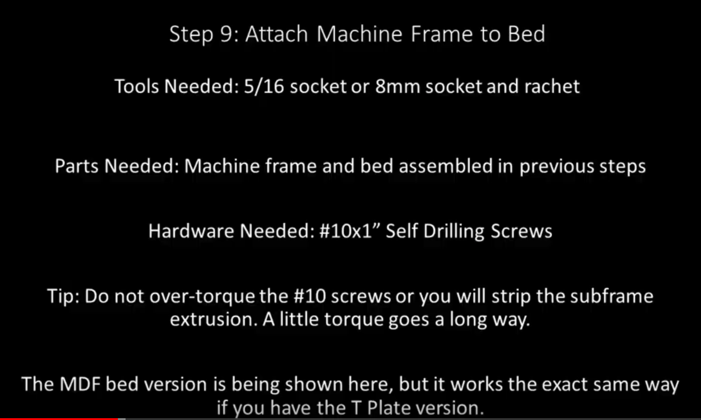
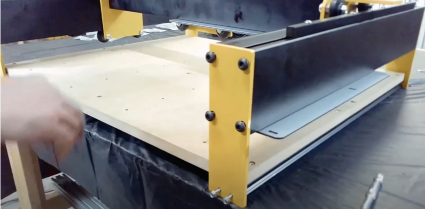

Section 9: Attach Machine Frame to the Bed
==========================================

.. raw:: html

   <iframe width="853" height="480" src="https://www.youtube.com/embed/jbYK1Pekhf0?start=831" frameborder="0" allow="accelerometer; autoplay; encrypted-media; gyroscope; picture-in-picture" allowfullscreen></iframe>

.. note:: These steps are identical for the T-Plate and MDF beds.

.. warning::  The sub-assemblies in this part are heavy.  Respect your physical limits and get help positioning everything.  You can’t make chips from a hospital bed…well except ice chips but that’s less fun than a walnut sign.

Section 9a: Supplies Needed
---------------------------
#. Parts Needed:

   #. T-Plate Sub-Assembly (1) 

   #. Gantry and Rails Sub Assembly (1)

   #. #10x1 Self Tapping screws (8)

#. Tools Needed:

   #. 4mm hex key for the M5 screws
   
   #. 5/16” or 8mm socket and socket wrench
   
   #. Optional oil (cutting oil, WD40, 3-in-1, motor oil, even corn oil) for the self tapping screws

Section 9b:  Connecting the assemblies
--------------------------------------

YouTube Bookmark: https://youtu.be/jbYK1Pekhf0?t=835

1. Place the Gantry sub assembly on the bed aligning the Y end plates to the corresponding holes in the subframe extrusions
   
   .. note:: If you can’t get the Gantry over the bed you may have your rear 2 Y-Plates to tight.  Just loosen the 4 button cap screws on each of the plates to give you more wiggle room

2. Get 4 #10 self drilling screws and align them to the 4 holes in the 2 front Y end plates

3. Put a drop of oil on the threads of each self tapping screw and start them in each hole with your fingers

4. Use the #10 socket wrench to carefully tighten each screw into the holes being careful to keep them straight as they are cutting into the sub-frame extrusion and alternating screws to get consistent torque
   
   .. warning::  Do not overtighten the #10 screws or you will strip out the extrusion 

5. After the front screws are in move to the rear of the machine and repeat the process with the rear screws.  Just take your time and ensure its lined up a you go once again alternating between the 5 #10 screws until they are snug

6. Tighten the 8 M5 button cap screws on the 2 rear Y end plates

7. Check your square at all corners now

8. Go back and do a final tightening on each of the #10 screws.  They will now ratchet so far that you can’t screw them so be careful not to strip the screws