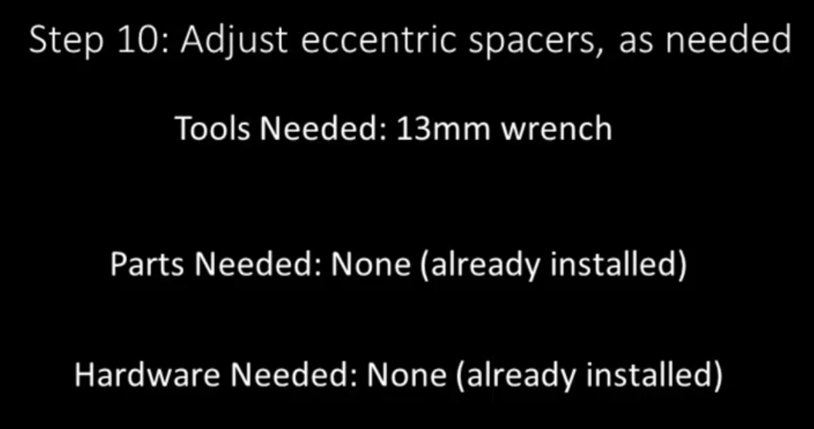
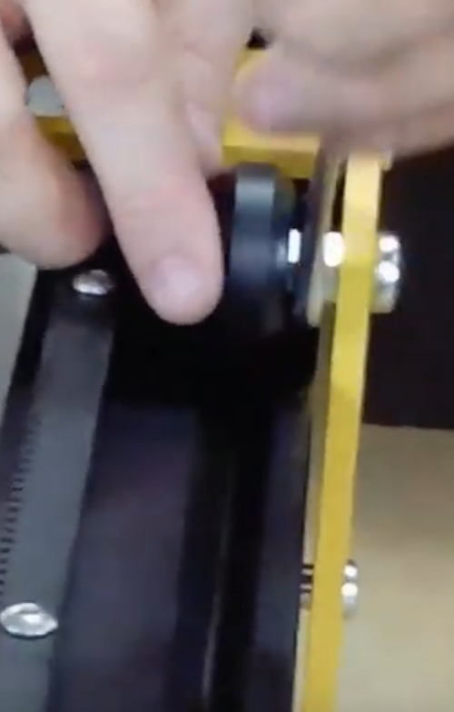

Section 10: Adjust the Eccentric Spacers
========================================
.. raw:: html

   <iframe width="853" height="480" src="https://www.youtube.com/embed/jbYK1Pekhf0?start=1029" frameborder="0" allow="accelerometer; autoplay; encrypted-media; gyroscope; picture-in-picture" allowfullscreen></iframe>

Section 10a: Supplies Needed
----------------------------
#. Parts Needed:

   #. None

#. Tools Needed:

   #. 13mm Wrench

Section 10b:  Connecting the Assemblies
---------------------------------------

YouTube Bookmark: https://youtu.be/jbYK1Pekhf0?t=1033

With the main structural elements of the Mega V finally connected this is the first step in tuning the build.  If you can easily spin the V-wheels 
sitting in the rails you can tighten the eccentric spacers to push the V-Wheels more firmly into the V-Channel.  The key thing is to have each v-wheel 
feel as tight as the others at each spacer.  This will ensure an even gripping of the rail.

1. To tighten just put the 13mm wrench on the eccentric and make sure that your marks from earlier are still showing the loose side is up.  Give them a 1/8 turn to add more grip

2. If the eccentric nut is all the way in the tight position and you still don’t have enough grip the your M8 screw and Nylock nuts aren’t tight enough.  
   
   1. Loosen the eccentric
   
   2. Then tighten the screw and nut with a M8 socket and #1 Phillips head screwdriver.
   
   3. Repeat the eccentric tightening process

3. Repeat one and 2 for all 4 V-Wheels with Eccentrics until at the appropriate tightness.
    
   * Watching this section of the video to see how they spin for Derek is helpful

.. note:: When done the gantry should smoothly slide back and forth on the rails with no scrapping.  There should be equal resistance the whole way up and down the rails with no binding.  Binding is usually due to the overall structure not being square and can require adjusting 

..  todo:: <TODO LINK TO SQUARING SECTION>