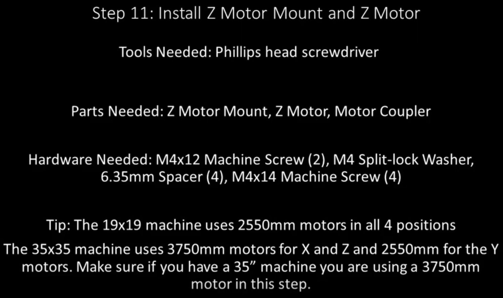

Section 11: Install Z Motor Mount and Z Motor
=============================================
.. raw:: html

   <iframe width="853" height="480" src="https://www.youtube.com/embed/jbYK1Pekhf0?start=1142" frameborder="0" allow="accelerometer; autoplay; encrypted-media; gyroscope; picture-in-picture" allowfullscreen></iframe>

Section 11a: Supplies Needed
----------------------------
#. Parts Needed:

   #. Z Motor Mount (1)

   #. Z Motor (1)

   #. Motor Coupler (1)
   
   #. M4x12mm machine screws (2)
   
   #. M4 Split-lock washers (2)
   
   #. 6.35mm Spacer (4)
   
   #. M4x14mm machine screws (4) (Note M4x18mm or even M4x20mm can be substituted for stronger connections)

#. Tools Needed:

   #. #2 Phillips head screw driver

   #. 5.5mm socket or needle nose pliers

Section 11b: Attach the Z motor mount 
-------------------------------------

YouTube Bookmark: https://youtu.be/jbYK1Pekhf0?t=1046

1. Get the Z motor mount plate
  
   .. image:: section_11b_motor_plate.png
      :width: 30%

2. Put the slot in the motor mount over the top of the X-plate

3. Get an M4x14mm screw and a lock washer under the head for each hole

4. Optionally apply loktite to the screws now

5. Secure the 2 screws to final torque into the X-Plate

Section 11c: Attach the Motor coupler
-------------------------------------

YouTube Bookmark: https://youtu.be/jbYK1Pekhf0?t=1240

1. Turn the lead screw to lift up the Z plate and verify the screw is seated into the plastic Z plate

2. The lead screw may need its M5 screws tightened at the point If it id not aligned well for the coupler 

3. Place 4 6.35mm spacers on each corner of the motor mount plate. 

   .. note:: In the video Derek refers to these as 1/4” spacers

   .. image:: section_11_c_spacers_on.png
      :width: 25%

4. Slide the coupler onto the Z screw and adjust the 2 M5’s on the Z plate as needed to move the lead screw to be centered into the motor mount opening
  
   .. note::  The coupler is not symmetrical, one side is 8mm and the other is 6.35.  Put the 8mm end over the lead screw

5. Push on the coupler to ensure it is fully seated on the lead screw

Section 11d: Attach the Motor
-----------------------------

YouTube Bookmark: https://youtu.be/jbYK1Pekhf0?t=1330

.. warning:: Check the length of your motor cables.  For the 19” all for are 2550mm for the 35” machine the X, Y1 and Z are 3750mm and the Y2 (left side Y motor) is 2550mm
             2550 = 1180g
             3750 = 1240g

 
.. note:: Please review section 11e as you may want to do that prior to this section

1. After verifying you have the correct motor align the motor shaft to the coupler and place it on top of the 4 spacers on the motor plate

2. Align all the wires to point out towards the back of the gantry

3. Insert the shaft of the motor into the 6.35mm opening of the coupler

4. Optionally apply loktite at the next step

5. Grab 4 M4x12mm machine screws insert into the holes in the motor mount
   
   .. warning:: This screw length is controversial and consensus is that an M4x18mm or M4x20mm is preferable as it will fully engage all the threads in the motor mount plate.  
                Consensus has also been that socket cap screws are preferable for this role.  With that said, it is your choice use the parts MillRight provided or not to.
 
6. Equally tension the screws

7. Rotate the coupler manually and make sure the the heads of the 2 sets screws on the motor coupler are both going to clear the X-plate and not collide with the plate

8. Going through the notch in the back of the X plate tighten the set screws to secure the coupler to the 2 shafts

Section 11e: Finish securing the linear rails on the X plate
------------------------------------------------------------

YouTube Bookmark: https://youtu.be/jbYK1Pekhf0?t=1509

.. note: 1) I prefer to do this section prior to attaching the motor so I can verify the rails are square and don’t bind at all.  Without the motor attached it is much easier to adjust
           Z-Binding is a common issue and its best to have it resolved now rather  than have to  come back and take the Mega V apart again.
         2) It is critical that there is no binding as you secure the rails to the x-plate or you will be disassembling this later.

1. Remove the 2 plugs from the lower end of the Linear rails

2. Attach the m3x16mm machine screws to the rails

3. Secure the screws with he m3 nylock nuts to finger tight 

4. Verify the Z plate can move the full length of the rails without binding

5. Gradually tighten all the M3x16mm screws.  Overtightening will result in binding also so verify smooth movement before moving onto the next section

