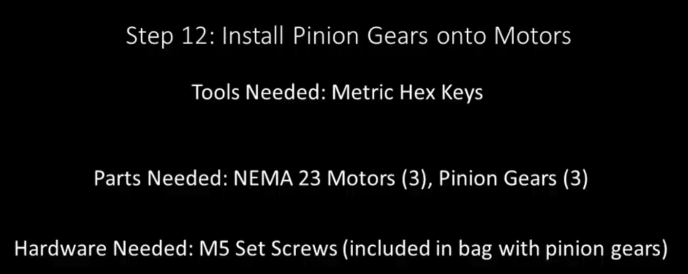

Section 12: Install Pinion Gears onto Motors
============================================
.. raw:: html

   <iframe width="853" height="480" src="https://www.youtube.com/embed/jbYK1Pekhf0?start=1617" frameborder="0" allow="accelerometer; autoplay; encrypted-media; gyroscope; picture-in-picture" allowfullscreen></iframe>

Section 12a: Supplies Needed
----------------------------
#. Parts Needed:

   #. X Motor (1) Note will be the same as the Y Motors if you have a 19” Mega V

   #. Y Motors (2)

   #. Pinion gears (3)

   #. M5 set screw/grub screw (6)

#. Tools Needed:

   #. ??mm Hex key for set screws

   #. 4mm Hex Key

Section 12b: install the pinion gears onto the shafts of the 3 motors 
---------------------------------------------------------------------

YouTube Bookmark: https://youtu.be/jbYK1Pekhf0?t=1620

1. Place the gear on the shaft

2. Place the set screw on the end of the hex key

3. Optionally apply loktite to the set screw

4. Insert the set screw into the opening on the side of the pinion gear

5. Secure it in the hole but don’t block the shaft of the pinion gear with it

6. Slide the pinion gear down the motor shaft ensuring the set screw is aligned to the flat portion of the motor shaft
 
   .. note::  The pinion gear must be an exact distance down the motor shaft

7. Yes your 4mm hex key which you used to tighten the M5 button cap screws as a spacer to fix the distance from the motor to the base of the coupler

8. Tighten the set screw

9. Repeat with the second set screw

10. Repeat steps 1-9 for the other 2 motors

11. Verify the pinion gear positioning with calipers 
  