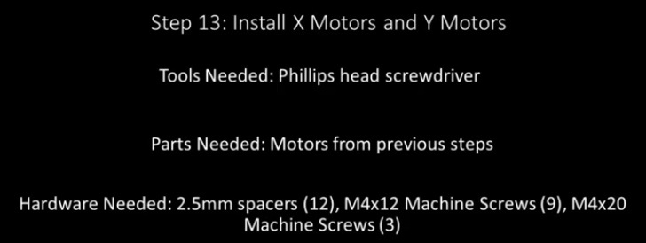

Section 13: Install X and Y Motors
==================================
.. raw:: html

   <iframe width="853" height="480" src="https://www.youtube.com/embed/jbYK1Pekhf0?start=1756" frameborder="0" allow="accelerometer; autoplay; encrypted-media; gyroscope; picture-in-picture" allowfullscreen></iframe>

Section 13a: Supplies Needed
----------------------------
#. Parts Needed:

   #. X Motor (1) Note will be the same as the Y Motors if you have a 19” Mega V
   
   #. Y Motors (2)
   
   #. 2.5mm spacers (12)

   #. M4x12mm Machine screws (9) 
   
      .. note::  Socket cap screws can be substituted to minimize risk of stripping

   #. M4x20mm machine screws (3)

#. Tools Needed:

   #. #2 Phillips head screw driver

Section 13b: Install the Y motors 
---------------------------------

YouTube Bookmark: https://youtu.be/jbYK1Pekhf0?t=1760

.. warning:: Check the length of your motor cables.  For the 19” all for are 2550mm for the 35” machine the X and Z are 3750mm and the 2 Y’s are 2550mm

1. Place 4 2.5mm spacers on the Y motor mount

2. Slide the gantry all the way forward so that the V-Wheels touch the Y end plates

3. Slide the toothed gear rack forward so the gear teeth will be able to engage the motor in this position ensuring the gantry has full freedom of travel
   
   .. note:: You may need to loosen the gear rack screws in order to slide it around

4. Tilt the motor as you insert the pinions into the hole in the Y motor mount plates and rotate the pinion to mesh it with the teeth of the gear rack seating the motor onto the 4 spacers at the same time.
 
   .. image:: section_13b_motor_tilting_in.png
      :width: 30%

5. Confirm that the gear rack is still in the right position to ensure maximum gantry travel a few teeth after the pinion is good.

6. Using 3 M4x12 machine screws and 1 M4x20mm machine screw secure the motor to the motor plate with the wires pulled forward

   .. note::  Make sure the m4x20mm screw goes in the outside front spacer.

   .. image:: section_13b_spacer_layout.png
      :width: 30%

7. Loosely tighten the screws to get everything positioned 

8. Position the gantry so that you can just get a hex key in to tighten the gear rack screw

   .. image:: section_13b_gear_rack_positioning.png
      :width: 30%
9. Pull the gear rack toward the outside of the rail and ping the pinion gear to the gear rack

10. Secure the screw in the gear rack

   .. image:: section_13b_pinion_pinching.png
      :width: 30%

11. Get it snug but not completely torqued so you can adjust the rest of the gear rack

12. Slide the gantry up to the next screw in the gear rack 

    .. warning::  Don’t get your fingers pinched in the pinion

13. Repeat steps 9-13 for all remaining screws (4 in total for 19x19, 7 for 35x35)

14. Slide the gantry to the front machine

15. Move the gantry the length of the rail and make sure the pinion doesn’t hit the rail at any point

16. If it does hit the rail then you have too much space between your pinion and motor. You will need to go back to section 12 and reseat the pinion

17. Repeat all of steps 1-17 for the other Y motor 

Section 13c: Install the X motors 
---------------------------------

YouTube Bookmark: https://youtu.be/jbYK1Pekhf0?t=2080

1. Install the 4 2.5mm spacers into the plate

   .. image:: section_13c_spacers.png
      :width: 50%

2. Orient the motor such that the wire will be facing the right side of the machine if looking from the front

3. Tilt the motor into the hole and rotate the pinion to mesh with the gear rack

   .. image:: section_13c_x_motor_positioning.png
      :width: 50%

4. Using 3 M4x12 machine screws and 1 M4x20mm machine screw secure the motor to the motor plate with the wires pulled forward
   
   .. note::  Make sure the m4x20mm screw goes in the outside front spacer.

5. Loosely tighten the screws to get everything positioned but with a little play

6. Slide the Z gantry all the way tot he end of the rail

7. Full the gear rack forward and pinch the the rack and pinion together 

8. tighten the screw in the gear rack

9. Slide the gantry to the next gear rack screw and repeat the process for all 7 screws