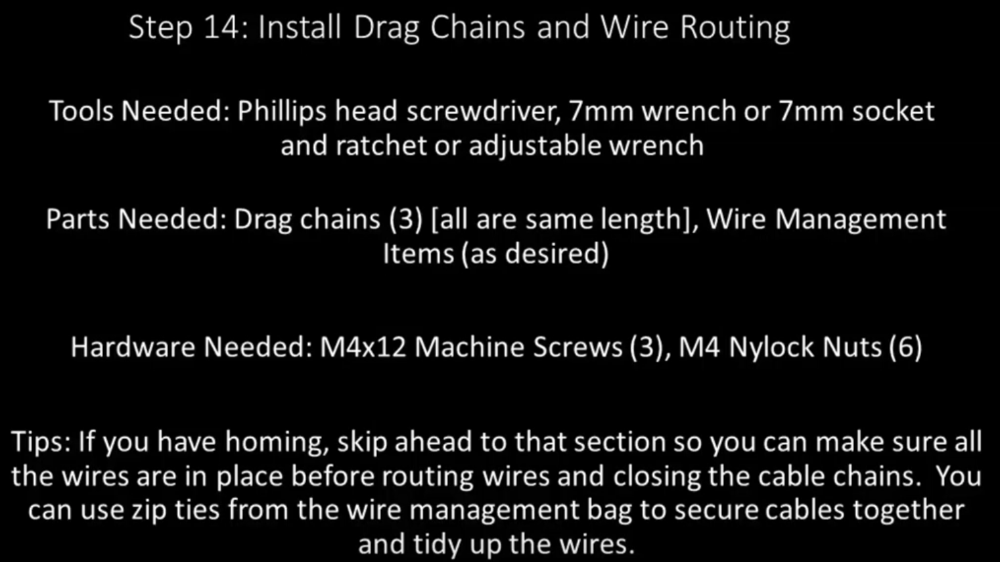
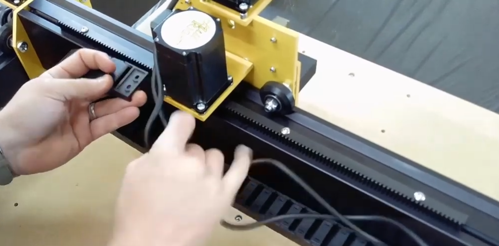
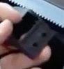

Section 14: Install Drag Chains and Wire Routing
================================================
.. raw:: html

   <iframe width="853" height="480" src="https://www.youtube.com/embed/jbYK1Pekhf0?start=2294" frameborder="0" allow="accelerometer; autoplay; encrypted-media; gyroscope; picture-in-picture" allowfullscreen></iframe>

Section 14a: Supplies Needed
----------------------------
#. Parts Needed:

   #. Drag chains (3)

   #. Wire management items (zip ties and poly wrap as needed)

   #. M4x12mm machine screws (3)

   #. M4 Nylock Nuts(6)

#. Tools Needed:

   #. #2 Phillips head screw driver
   #. 7mm wrench or 7mm socket or 7mm adjustable wrench

Section 14b: install drag chains
--------------------------------

YouTube Bookmark: https://youtu.be/jbYK1Pekhf0?t=2298

.. important::  If you purchased homing switches please jump to :ref:`Homing_Switches` and set them up before installing drag chains.

The drag chains are used to organize the wiring running through the mega V.  Each drag chain has 2 screw holes at each end which will attach to the M4x20mm screw that was put in each motor mount.

1.  Snap open all the little doors on all 3 drag chains with a screw driver as a prybar

2. Get the X drag chain

3. Place the screw hole in the drag chain closest to the X Gantry through the screw hole in the drag chain.
   .. image:: section_14b_drag_chain_holes_on_screw.png
   :width: 20%

4. Secure the drag chain to the screw with an M4 Nylock Nuts.

   .. image:: section_14b_drag_chain_screwed_in.png
      :width: 50%

5. Place the remainder of the drag chain on the drag chain support plate.

6. Take M4x12mm screw and pass it through the drag chain screw hole and into the far slot of the drag chain support plate.

7. Secure the drag chain to the screw with a M4 Nylock Nut and a 7mm wrench/socket.

8. Optionally you can drill and extra hole in the drag chain to use the middle slot in the drag chain support plate.

9. Get the Left and right Y Drag chain supports

10. Secure the drag chain to the screw on the Y Motor Mounst with an M4 Nylock Nuts.

11. Place the remainder of the drag chain on the drag chain support plate.

12. Take M4x12mm screw and pass it through the drag chain screw hole and into the far slot of the drag chain support plate.

13. Secure the drag chain to the screw with an M4 Nylock Nutand a 7mm wrench/socket.

14. Optionally you can drill and extra hole in the drag chain to use the middle slot in the drag chain support plate.

Section 14b: Route the Wires
----------------------------

.. note::  MillRight assumes the control box will be on the back left of the Mega V so these steps assume that when laying down the cables

1. Mark each of the motors cables so you know which is which.  A sharpie and some blue painters tape is great for this

2. For the X Drag Chain gather all the wires and lay them in the chain routing them to the left until the come out by the Y motor

   .. image:: section_14b_route_x_wires.png
      :width: 75%

3. Move the X Gantry back and forth to make sure the cables don't bind as the drag chains move

4. Tuck the wires between the Left Y Motor and the Gantry plate

5. Gather up the Left Y Motor and homing wires and feed them all down into the Left Y drag chain

6. For the right Y motor just run the motor cable through the drag chain then behing the back of the mega V to the Control Box

7. Snap all the drag chain doors shut
