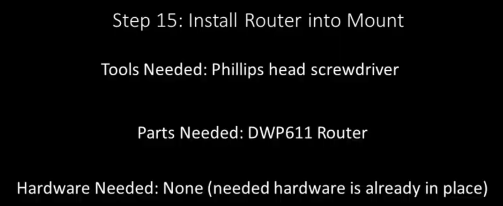

Section 15: Install Router into Mount
=====================================

.. raw:: html

   <iframe width="853" height="480" src="https://www.youtube.com/embed/jbYK1Pekhf0?start=2770" frameborder="0" allow="accelerometer; autoplay; encrypted-media; gyroscope; picture-in-picture" allowfullscreen></iframe>

Section 15a: Supplies Needed
----------------------------
#. Parts Needed:

   #. DWP611 Router

#. Tools Needed:

   #. #2 Phillips head screw driver

Section 15b: installing the router
----------------------------------

YouTube Bookmark: https://youtu.be/jbYK1Pekhf0?t=2774

1. Grab the Z coupler

2. Rotate the coupler while applying downward pressure on the Z plate until it is all the way down

   .. image:: section_15b_rotating_coupler.png
      :width: 50%

3. Pick up the router and place it into the opening of the router plate 

4.  Have the power cord of the router facing to the right

5.  rotate the coupler the opposite direction lift it up to the router you are holding

6. Keep rotating the coupler until it is just in contact with the U indent at the top of the Z Plate
   
    .. image:: section_15b_router_in_plate.png
       :width: 50%

7. Now lift up the router until it is just below the motor mount  plate (approx 1/16")

    .. image:: section_15b_router_gap.png
       :width: 50%

8. Using the Phillips Head Screw driver tighten the pinch bolt in the front of the router plate

    .. image:: section_15b_pinch_bolt.png
       :width: 50%

.. note::  The router power cable looks like you could route it in the drag change.  Don't do it!  
           The power flowing to the router can cause signal noise in the homing sensors and other electronics.  Keep them far apart.

Section 15c: Initial squaring and tramming
------------------------------------------

YouTube Bookmark: https://youtu.be/jbYK1Pekhf0?t=2873

1. Take a speed square and place it on the bed

2. Position the square on the front of the router and then each side and verify the router is at a right angle to the bed

.. note:: Brad Ellerbroek's tramming plate is a big help with this and was mentioned in :ref:`Brad`.

3. If it isn't square loosen the pinch bolt and reseat the router then tighten the pinch bolt

.. warning:: This can be a maddening process that takes a lot of time if you try to be a perfectionist.

4.  Derek mentions a tramming video on the MillRight boards.  It can be found `here <https://millrightcnc.proboards.com/thread/1468/tram-spindle-on-cheap>`_

5. As an alternative to Derek's instructions in the video, Winston Moy has a great tramming video for a competing CNC but its totally applicable to the Mega V.  Please watch it https://www.youtube.com/watch?v=rGOGlNurglE

6. I found this video on CNCNuts recently which I found helpful in tramming `here <https://www.youtube.com/watch?v=D6pfIoyhgTc`_

7. A 3d printable tram arm can be downloaded at https://www.thingiverse.com/thing:4037880

*This section will be greatly expanded in the future.*