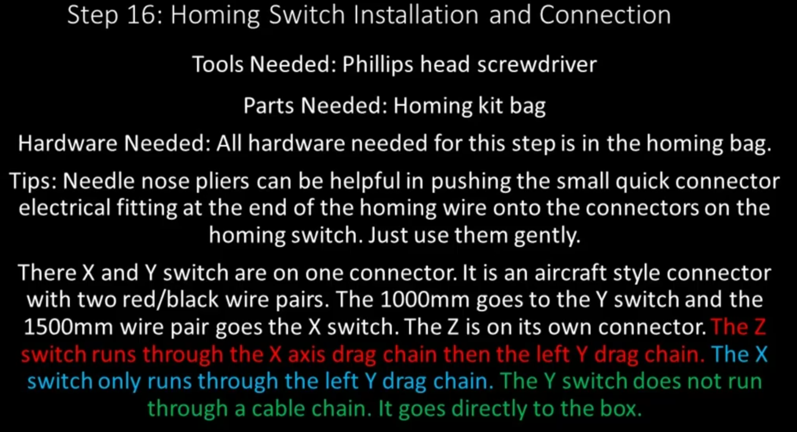
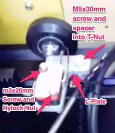
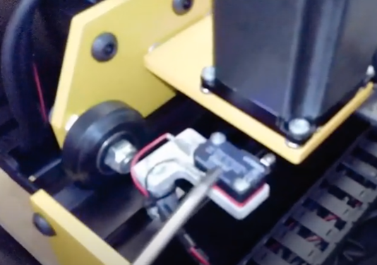
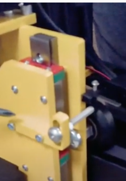

.. _Homing_Switches:

Section 16: Home Switch Installation and Connection
===================================================
.. raw:: html

   <iframe width="853" height="480" src="https://www.youtube.com/embed/jbYK1Pekhf0?start=3000" frameborder="0" allow="accelerometer; autoplay; encrypted-media; gyroscope; picture-in-picture" allowfullscreen></iframe>

Section 16a: Supplies Needed
----------------------------
#. Parts Needed:

   #. Supplies in Homing kit bag
      #. M3x20mm machine screws (6) <CONFIRM>

      #. M5x30mm machine screw (2) <CONFIRM>

      #. M5x40mm button cap screw (1)

      #. M5 Washer (2)

      #. M5 Split lock washer (1)

      #. M5 Hex Nut (1)

      #. Aluminium Spacer (2) <CONFIRM>

      #. M5 Drop-in T-Nut (2) <CONFIRM>

      #  M3 Nylock Nuts (6)

      #. X Homing Switch (1500mm long) (1)
      
      #. Y Homing Switch (1000mm long) (1)

      #. Z Homing Switch (1)

      #. Homing Switch Mounting Plate (2)

#. Tools Needed:

   #. #2 Phillips head screw driver

   #. 2.5mm Hex Key
   
   #. Needle Nose Pliers or 5.5mm socket wrench

.. important:  These homing wires have been a challenge for people.  Many people have reported them being too short and the crimp on blades at the ends not being securely fastened.
               Before starting this section please really inspect the wired.  
               
               Tug on the blades and make sure they are secure.  If you have a multimeter test continuity at both ends of the wire.   
               
               Roughly layout the cables if they seem short for where you indend to put your control box then now is a great time to order some 18 gauge stranded wire and blade terminals and make your own. 
               If you are comfortable soldering, then ditching the blade terminals and just soldering/heat shrinking the wires to the connectors on the homing switches will eliminate a ton of potential pain.

Section 16b: Installing the X-Homing Switch
-------------------------------------------

YouTube Bookmark: https://youtu.be/jbYK1Pekhf0?t=3003

   
   X-Homing Switch Installed

1. Get the L Plate and place the X Homing Switch on it with the reed facing the foot of the L

2. Insert 2 M3x20mm screws into the 2 holes in the Homing Switch

3. Attach the 1500mm wire to the Homing Switch.  Black goes to the blade connector on the long side, Red to the short side on the connector closest to the black wirw

4. Using the hex key and either needle nose pliers/5.5 mm socket secure the screws with 2 M3 Nylock Nuts

5. Place a drop in T-Nut into the T Track on the Left side

   .. note:  For a few weeks MillRight was mistakenly shipping normal T-Nuts and not drop in T-Nuts.  If you got a kit like this you can contact MillRight  For replacements or just source your own on Amazon.
             If you have a dremel with a metal cutting disk or a angle grinder you can use either to modify the standard T-Nuts into drop-in T-Nuts.

             Pics courtsey of John Kopecky

             .. image:: section_16b_cutting_the_nut.png
                :width: 30%

             .. image:: section_16b_chopped_nut.png
                :width: 30%

6. Slide the M5x30mm machine screw through the hole in the L of the L-plate

7. Slide an Aluminium spacer onto the M5x30mm machine screw

8. Secure the M5 Screw into the T Nut

9. Slide the X Gantry until it hits the Homing switch 

    .. important:  Make sure there are several teeth remaining on the gear rack when the plate hits the switch

10. Securely tighten the M5 screw into the T-Nut

11. Use a ziptie to secure the homing wire cable to the spacer

12. Route the homing switch wire into the drag chain

Section 16c: Installing the Y-Homing Switch 
-------------------------------------------

YouTube Bookmark: https://youtu.be/jbYK1Pekhf0?t=3081

   
   Y-Homing Switch Installed

This is basically the same process as for the X-Homing Switch

1. Get the L Plate and place the X Homing Switch on it with the reed facing the foot of the L

2. Insert 2 M3x20mm screws into the 2 holes in the homing Switch

3. Attach the 1000mm wire to the Homing Switch.  Black goes to the blade connector on the long side, Red to the short side on the connector closest to the black wirw

4. Using the hex key and either needle nose pliers/5.5 mm socket secure the screws with 2 M3 Nylock Nuts

5. Place a drop in T-Nut into the T Track on the back Left side by the X Homing Switch

   .. note:  For a few weeks MillRight was mistakenly shipping normal T-Nuts and not drop in T-Nuts.  If you got a kit like this you can contact MillRight  For replacements or just source your own on Amazon.
             If you have a dremel with a metal cutting disk or a angle grinder you can use either to modify the standard T-Nuts into drop-in T-Nuts.

             Pics courtsey of John Kopecky

             .. image:: section_16b_cutting_the_nut.png
                :width: 30%

             .. image:: section_16b_chopped_nut.png
                :width: 30%

6. Slide the M5x30mm machine screw through the hole in the L of the L-plate

7. Slide an Aluminium spacer onto the M5x30mm machine screw

8. Secure the M5 Screw into the T Nut

9. Slide the Y Gantry until it hits the Homing switch 

    .. important:  Make sure there are several teeth remaining on the gear rack when the plate hits the switch

10. Securely tighten the M5 screw into the T-Nut

11. Use a ziptie to secure the homing wire cable to the spacer

    .. image:: section_16c_homing_switch_ziptie_installed.png
       :width: 75%

12. Route the homing switch wire into the drag chain

Section 16d: Installing the Z-Homing Switch
-------------------------------------------

YouTube Bookmark: https://youtu.be/jbYK1Pekhf0?t=3189

   
   Z-Homing Switch Installed

1. On the Z Router Assembly go back to the Z Homing bracket that was installed earlier

2. Install 2 M5 washers onto the M5x40mm screw

3. Insert the screw+washers into the Z Homing bracket

4. On the other side of the bracket place an M5 Lock Washer on the screw and an M5 Hex Nut

5. Slide the screw to about the middle of the slot in the bracket and tighten the Nut
   
   ..  note: The Homing Bracket fitment allows some left/right play in its positioning.   If it is too far over the M5 screw going through it may hit the metal of the X plate.  If that happen loosen the 2 screws and slide it over to ensure it doesn't hit.

6. Attach the remaining wire to the Homing Switch.  Black goes to the blade connector on the long side, Red to the short side on the connector closest to the black wirw

7. On the other side of the Z Router Assembly you will position the homing switch so the blade extends off of the side of the Router plate

8. Take 2 M3x20mm machine screws and pass them through the front of the router plate and through the holes on the homing switch

9. Secure the homing switch with 2 M3 Nylock nuts using a hex key and needle nose pliers or a 5.5mm socket
   
   .. image:: section_16d_homing_switch_installed_2.png
      :width: 75%

   .. warning:  Don't over tighten these nuts and break your homing switch

10. Rotate the Coupler to lift the Z-plate and wait for it to Click the Z Homing Switch

11. Ensure that the click occurs just before the Z-Plate hits the Coupler to ensure you get maximum Z-axis travel

   .. image:: section_16d_plate_positioning.png
      :width: 75%

12. Route the homing switch wire into the drag chain