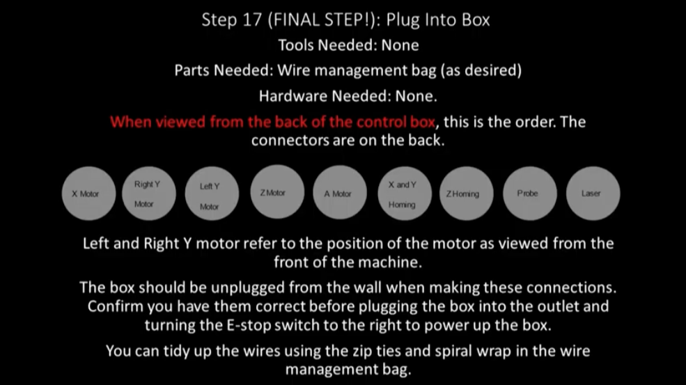

Section 17: Plug into the Box
=============================

.. raw:: html

   <iframe width="853" height="480" src="https://www.youtube.com/embed/jbYK1Pekhf0?start=3393" frameborder="0" allow="accelerometer; autoplay; encrypted-media; gyroscope; picture-in-picture" allowfullscreen></iframe>

Section 17a: Supplies Needed
----------------------------
#. Parts Needed:

   #. Wire management bag (as desired)

#. Tools Needed:

   #. None

Section 17b: Plug order from LEFT to RIGHT
------------------------------------------

.. important:: The control box should be unplugged from the wall power before connecting any wires

1. X Motor

2. Right Y Motor (as viewed from the front of the machine)

3. Left Y Motor (as viewed from the front of the machine)

4. Z Motor

5. A Motor (4th axis...connector not present in pictures)

6. X and Y Homing

7. Z Homing

8. Touch Probe and Bit Setter

9. Laser (connector not present in pictures)

 .. image:: section_17b_Plug_layout.png
            :width: 75%

.. important::  MillRight assumes the control box will be at the back left of the machine.   Any other placement will require extension of the wires.

The connectors are call 4 pin airplane connectors which only go in one way to the sockets.  Simply insert each cable in the socket and screw down the shield to firmly attach it to the controller.

