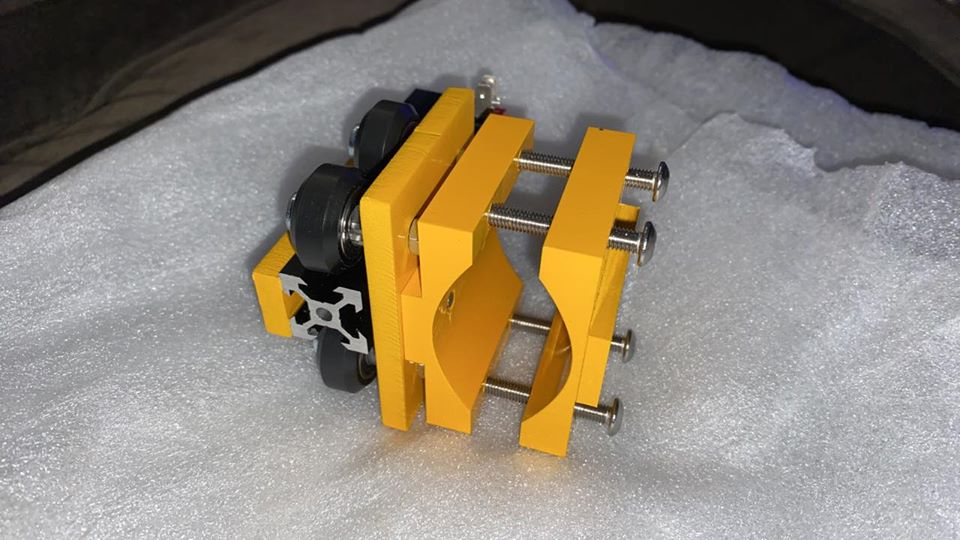
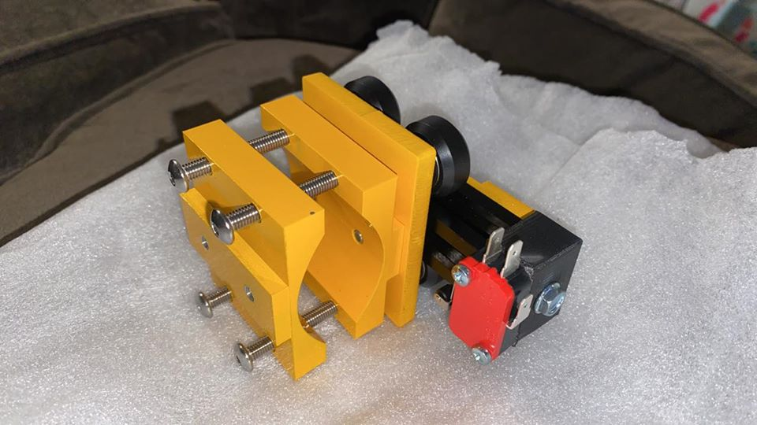
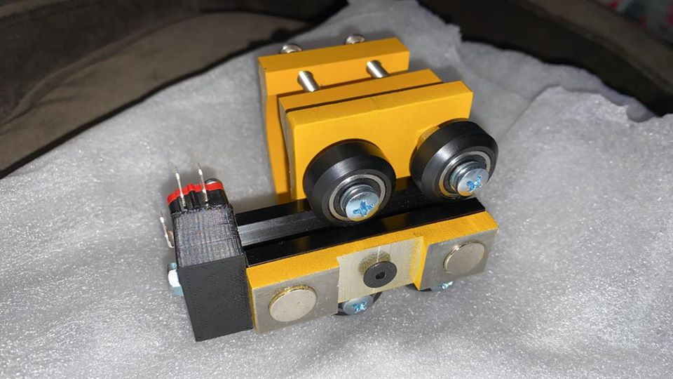

Plasma Cutter Version Specific Setup
====================================

TBD -  The Author doesn't own this verison so will need help from others

Section 20a: Supplies Needed
----------------------------
#. Parts Needed:

   #. V-Wheels (4)

   #. Bearings (8)

   #. M8 Washers (4)

   #. M8 machine screws short (4)

   #. M8 machine Screws long (4)

   #. M8 Lock Washer (4) (I think) could be regular M8 washers

   #. M8 eccentric spacers (4)  

   #. M8 Nuts (4) I think

   #. Aluminium Extrusion(1)

   #. Limit Switch (1)

   #. M3x20mm machine screws (2)

   #. Limit Switch Wiring Harness (1)

   #. Plasma Plate Halves (2)

   #. Magnet plate and black mounting screw

   #. TBD other parts I can't tell from the picture 

#. Tools Needed:

   #. Hex Keys

   #. Socket Wrenchs

   #. M8 Wrenchs

   #. #1 or #2 Phillips Head Screw Driver

.. note::  While not advertised yet on the site a THC can be ordered separately from MillRight for $249 if you mail sales.

Section 20b: Set up the V-Wheels
--------------------------------

Please just follow the same process as :ref:`Bearings`

Section 20b: Setting up the Plasma Mount
----------------------------------------

Someone with a plasma version please give feedback

Pictures courtsey of Dan Zakula Jr.

Based on the pictures it looks like you do the following:

1. Place a M8 Lock washer on each of the short M8 screws

2. slide a V-Wheel down the Screw shaft

3. Slide a eccentric spacer after the V-Wheel 

4. Pass the screw into the Back of Plasma mount 

5. Slip a M8 Nut between the 2 plates of the back plate holding it with a wrench or needle nose pliers

6. Using a phillips head screwdriver secure the V-Wheel to the Nut

7. Repeat for the remaining 3 V-Wheels

8. Secure the front router plate to the back plate with the 4 long  M8 screws

9. Secure the magent plate to the aluminium extrusion with the black flat head screw

10. Using 2 m3 screws secure the homing switch to the 3d printed block

11. Secure the 3D printed block to the aluminum extrusion with the appropriate screw

12. Slide the Extrusion between the V-Wheels

13. Tighten the eccentrics on each V-Wheel

Section 20ac: Setting up the Plasma Table
-----------------------------------------
TBD