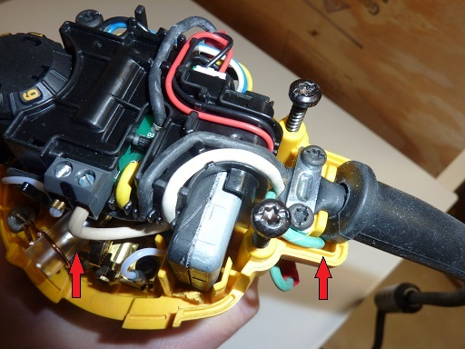

Section 20: Grounding the Router 
================================

Section 20a: Supplies Needed
----------------------------
#. Parts Needed:

   #. DWP611 Router

   # Ring terminal connector (1)

   #. 90° female spade connector (1) (`Amazon Link (UNTESTED but should work <https://www.amazon.com/RuoFeng-Insulated-Disconnects-Electrical-Terminals/dp/B07JL5PYMS>`_ )

   #. 18 Gauge Grounded Power cord rated to 90°C (`Amazon Link <http://www.amazon.com/Superior-Electric-EC183-Feet-Electrical/dp/B004GUAJEM>`_)

#. Tools Needed:

   #. Power Drill and 1/8" drill bit

   #. Phillips Head Screw Driver

   #. Hex keys

   #. A multimeter

Section 20b: Grounding the DWP611
---------------------------------

[Ref]_ Out of the box the router has a 2-prong non-grounded power cord.  Noisy electronics are a on-going challenge for hobby CNC machines and being a bit paranoid can save some pain. If you suspect noise is causing you problems this modification can be worth it

The linked to power cord has a description indicating that the cord material was "Case/Insulation: Rubber/Jute Fiber", and is rated to 105°C.  You want to use a similar cord that is flexible SJ/SJO/ SJOOW rated cable

1. Remove the Cover of the router

2. Unscrew the bracket holding the power cord down with a hex keys

   .. note:  Under the cord is where a hole will be drilled to support the ground wire.

   .. image:: 33-EarthGroundHoleLocation.jpg
      :width: 75%

3. Pull the power cord clear of the area needing to be drilled

4. Using a 1/8" drill bit a hole in the location, drill a hole in the location shown

   .. image:: 34-EarthGroundHoleDrilled.jpg
      :width: 75%

5. Remove the power cord from the power switch and router 

   1. Take the strain relief and snap-on-ferrite off of the old cable and transfer it to the new one

   2. If you have 90 degree spade connectors attach one to the black/hot of the new power cord and connect to the existing  power switch
   
   3. If not you don't then just cut the black/hot wire and solder/butt splice it to the HOT on the new power and connect it to the power switch.  Use heat shrink on the splice also.

      .. image:: 35-OriginalPowerSwitch.jpg
         :width: 75%

6. Re-connect the power switch

   .. image:: 36-NewPowerSwitchWire.jpg
      :width: 75%

7. Route the green earth ground wire from the power cord down into the hole you made

8. Crimp/solder a ring termal connector to the earth ground. 
   .. note:  Technically you can skip the connector if you don't have one

9. Unscrew the existing screw in the router housing and attach the ring terminal or raw ground wire to it.

10.  Replace the screw into the router housing

   .. image:: 38-NewGroundWireOutside.jpg
      :width: 75%

11.  If you have a multimeter (and you really should), test continuty between the router housing and the ground pin on the power cord to confirm it is now grounded

.. [Ref] This section is summarized from a carbide3d forum `post <https://forum.shapeoko.com/viewtopic.php?t=7556>`_