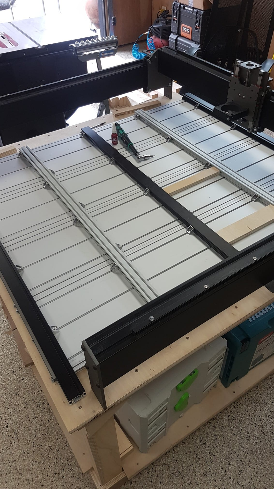

Section 2: What else can I spend money on?
==========================================

NOTE THIS IS  A ROUGH ROUGH DRAFT

Section 2a: Introduction
------------------------

Upgrades to the Mega V are very common and a frequent generator of questions on the forums is where to source various components for those projects.  This page is a fairly extensive list of things I have bought (yes I'm an idiot and no I have not itemized this ever for my spouse :-) ) and tried with my Mega V or used in the past.


Section 2b: Essentials Items
----------------------------

+------------------------------------------------------+-------------------------------------------------------+
| Item                                                 |                       Why                             |
+======================================================+=======================================================+
| :ref:`Roll in 2020 M5 T-Nuts and Slide in 3030 T-Nuts| Needed to secure items to the T-Tracks after assembly |
| <tnuts>`                                             |                                                       |
+------------------------------------------------------+-------------------------------------------------------+
| :ref:`Blue Loctite <loctite>`                        | To be put on literally every screw to help keep the   |
|                                                      | CNC from shaking itself apart while running.          |
+------------------------------------------------------+-------------------------------------------------------+
| :ref:`1-2-3 Machinist Blocks <123_blocks>`           | Machinists have used 1 2 3 blocks for years for       |
| `                                                    | tramming, making jigs, measuring, and squaring tools  | 
|                                                      | keeping it running optimally.                         |
+------------------------------------------------------+-------------------------------------------------------+
| `6' USB Cable with a Ferrite Bead                    | The Arduino USB ports are highly suseptible to any    |
| <https://amzn.to/2RGpKTc/>`_                         | inteference.  A quality USB cable can reall help      |
|                                                      | to reduce problems                                    |
+------------------------------------------------------+-------------------------------------------------------+
| :ref:`18/2 Shielded Wire<18/2_shielded_wire>`        | The homing switch kit comes with poor quality wire    |
|                                                      | that is too short to be of use.  This upgrade replaces|
|                   Or                                 | the original wire with em shielded heavier gauge      |
|                                                      |                                                       |
| :ref:`12/2 Shielded Wire<22/2_shielded_wire>`        |                                                       |
|                                                      |                                                       |
+------------------------------------------------------+-------------------------------------------------------+
| :ref:`Lubricants <lubricants>`                       | If it moves it will need lubricant                    |
+------------------------------------------------------+-------------------------------------------------------+
| Brad Ellerbroek's tramming plate                     | While this may not be 100% essential it really does   |
|                                                      | simplify the process of tramming the Mega V.          |
+------------------------------------------------------+-------------------------------------------------------+
| :ref:`Screws <screws>`                               | As of mid-August 2020, MillRight seems to now be      |
|                                                      | M4x14mm machine screws for mounting the stepper motors|
|                                                      | .I still prefer M4x16mm Socket Cap for the added      |
|                                                      | threads securing the motor and the better torque      |
|                                                      | a socket cap can handle.  Your call on if you should  |
|                                                      | get these.  In any case I do recommend this screw kit |
|                                                      | or similar just in case you are short something.      |
+------------------------------------------------------+-------------------------------------------------------+
| :ref:`Feeler Gauges<feeler_gauges>`                  | For measuring gaps                                    |
+------------------------------------------------------+-------------------------------------------------------+
|                                                      |                                                       |
+------------------------------------------------------+-------------------------------------------------------+
|                                                      |                                                       |
+------------------------------------------------------+-------------------------------------------------------+

Section 2c: Spare Parts
-----------------------
If you are generating income from your Mega V and this is more than a hobby for you, then downtime is money.  A 
proper set of spare parts is a small investment in insuring your revenue stream doesn't go away along with your customers satisfaction. 

While they don't advertise it on their site, MillRight will sell you spare parts if you reach out to their sales at support@millrightcnc.com. As noted
elsewhere most of the Mega V is commodity hardware which you can source elsewhere some things like the CNC Shield and V-Wheels are custom. I've found 
MillRight to be happy to take my money and ships quickly.

The spare parts that can be purchased from MillRight are:

* 2.5mm Spacers (qty 4)  - $2.00
* 6.35mm Spacers (qty 4) - $2.00
   While no sane person would take their Mega V apart as much as the author has, the steppers do need regular checking and those spacers seem to want to 
   escape if given the chance.  Spares can be a life saver if you lose one.
* Arduino Uno if 3-Axis (qty 1) - ???
   I don't have a 3-Axis machine so don't know what MillRight charges for a spare.  If anyone knows please let me know.
* Arduino Mega XL 4th Axis if 4-Axis (qty 1) - $17.00
   You can buy the Arduino's off the shelf on Amazon but they will need to be flashed with MillRights firmware.
* Mega V Eccentric Spacers (qty 4) - $10.00
* MillRight CNC Shield (qty 1) - $34.00
* MillRight StepperDriver (qty 1) - $36.00
    You may want to consider 2 for this so you can expand the Y to 2 independent drivers
* MillRight KS130 Stepper Motor with  longer cable (qty 1) - $35.00
* v-wheels and bearings (qty 8) - $44.00 
    I got extra due to some modifications I'm testing out

Other spares that can be bought separately are:

* `Dewalt Brushes <https://amzn.to/3hJRe53>`_

  .. note:: A little known fact is that a lot of Ace TrueValue hardware stores carry the replacement brushes for the Dewalt DWP611 router.  

* Homing Switches

  * `XY Homing Switches <https://amzn.to/3iOXc5V/>`_
  * `Z Homing Switch <https://amzn.to/2EfCltw>`_

* Z Coupler
  
  * `Befenybay 2PCS 6.35mm to 8mm Aluminium Plum Flexible Shaft Coupling <https://www.amazon.com/gp/product/B07T2HFSZR/>`_

Section 2c: Computer to Run From
--------------------------------
CNC's don't just run themselves...well not unless you spend a lot more money than you already have but thats a whole different book in need of authoring.  
While you can run your cuts from the same computer you design from, :term:`gcode senders` are best run from a dedicated host to minimize interferance if budget allows.   
The reason for this is that gcode senders must continuously stream :term:`g-code` to the :term:`cnc controller` in order to keep the stepper motors smoothly  moving and the router cutting.  
Other tools running in parallel can interfere with this and jeopardize the cuts.  If budget doesn't allow for a dedicated machine, then just be careful that nothing is running 
on the computer while running a job that could hog the CPU like a Virus Checker.

Choice of computer to use is highly personal and flexble.  Windows 10, Mac, or Linux based computers can run all the major gcode senders.  Windows 10 is most popular in this space with Linux 
close behind in popularity.  Hardware wise, if being used for just running gcode senders the hardware requirements are minimal.  4GB of ram, and an Intel Atom processor is more than enough to 
handle the overhead.  As a result, shopping Facebook Marketplace, OfferUp, and Craigslist for some ones scrap PC will find you a used computer for as low as $100. Try to find a system with Windows 10 Pro  
preinstalled if possible to gain the added remote management features.  

..  warning:: Used computers can have all manner of viruses and malware on them.  Before doing anything reset windows to factory defaults.  Instructions can be found at https://www.laptopmag.com/articles/reset-windows-10-pc

On the forum's these are examples of a few simple computers that are more than good enough that members have used:

* `10" Windows 10 Fusion5 Ultra Slim Windows Tablet PC- (4GB RAM, 128GB Storage, USB 3.0, Intel, 5MP and 2MP Cameras, Windows 10 S Tablet PC) (128GB) <https://amzn.to/2FOqkMa/>`_
   These will run from 175-$275 and are a decent small tablet that is windows capable and what the author uses.

* `Surface Pro 3 Refurb <https://computers.woot.com/offers/microsoft-surface-3-10-64gb-tablet-3>`_ 
   These regularly come up on Woot for around $300 and are a workhorse for a CNC machine.

* `LattePanda <https://amzn.to/2REz5v0>`_
    LattePanda - Of the options listed, this is the only one I've never seen run (for what little value my opinion asss). This is a tiny windows PC that also comes with an Arduino Leonardo on 
    board (people are using this type of Arduino to make CNC pendants). It will cost $189-$225 depending on windows licenses and will need a case but looks super slick.

* `Raspbery Pi 4 <https://amzn.to/3iQd208/>`_  
    A Linux alternative to a windows computer, that is a fantastic embedded computer that can be run either with or without a monitor which you may see referred to as *headless*. There is a bit more work involved in setting up a Raspberry Pi but it is more than capable of running machining jobs.

Section 2d: Computer Accessories
--------------------------------
A wireless keyboard can be a great remote to control the :term:`gcode senders`.  One to consider is:

* `EASYTONE Backlit Mini Wireless Keyboard With Touchpad Mouse Combo and Multimedia Keys  <https://amzn.to/3ccsMbu/>`_
   
   I use this with a Raspberry Pi 4 and it is a fantastic combo.  UGS, CNCJS, and Openbuilds Control all support keyboard based jogging.  Beaver CNC has a good `video tutorial <https://www.youtube.com/watch?v=zWXBgLULq-U>`_ on using this keyboard with CNCJS.

* `Artik Raspberry Pi 4 Case with GPIO Extension Header <https://amzn.to/3cdBPJ4/>`_
   
   The Raspberry Pi 4 runs hotter than the prior generations and a heatsink case is a good idea for managing that heat.

USB Hubs with power switches on the ports come in super handy. The controller seems to need the USB cable unplugged often and the power switches make this really easy to do.
   
* `RSHTECH Powered USB 3.0 Hub 4 Port USB Hub Splitter Portable Aluminum USB Data Hub Expander with Individual On/Off Switch and Universal 5V AC  <https://amzn.to/2EibyNp>`_

Section 2e: Endmills
---------------------
.. warning:: Amazon is full of Whiteside counterfeits.  Check the comments and reviews of any endmill you order from them.   
             People tend to call out fakes.  I won't buy Whiteside from Amazon after receiving a 
             counterfeit surfacing endmill.

.. warning:: Measure the shank of all endmills you receive especially from chinese imports.  Sometimes a metric endmill won't have a true 1/4" shank and the collet can't hold it firmly and you'll see :term:`runout<Runout>` and uneven depth of cuts from the slippage.

Endmills are complex enough that they deserve their own book.  It is my belief that a good starter set of endmills consists of:

* 1/4" shank 1/4" diameter 2 flute :term:`upcut<endmill>`
* 1/4" shank 1/4" diameter 2 flute :term:`downcut<endmill>`
* 1/4" shank 1/8" diameter 2 flute :term:`compression<endmill>`
* 1/4" shank 1.0mm tip :term:`ball nose<endmill>` (if 3d carving)
* 1/4" shank 1" or 1.5" spoil board surfacing endmill
* 1/4" shank 60 degree :term:`v-bit<endmill>`
* 1/4" shank 90 degree :term:`v-bit<endmill>`

If carving aluminium you may want to buy special coated upcut endmills that will resist aluminum sticking and generally last longer. Common coatings are Titanium Nitride (TiN) and the even harder Titanium Carbon Nitride (TiCN). There is a lot of debate on number of 
flute's for aluminium.  The accepted wisdom is 1 flute so that it makes larger chips which pulls heat aware from the cutting surface.  Many Mega V users report chatter with 1 flute and suggest 2 or even 3 flute cutters as they make more and smaller chips resulting in a higher quality finish.  
Over 3 flutes seems to hurt rather than help as the chips are too small to eliminate heat. Given all this, my suggestion is buy some cheap endmills to experiment with and then decide on if its worth the fancy coatings.  I've been shocked at how well a $2 cutter can perform.

Etching Acrylic and Tile comes up a lot as something people want to do. While it can  be done with a v-bit, there are special drag bits that can give a more detailed finish in acrylic and granite.
  
Drag  Endmills
    
   * `Diamond Drag Engraving Bit with 1/4" Shank for CNC Machines <https://www.widgetworksunlimited.com/CNC_Diamond_Drag_Engraving_Bit_p/cnc-dmnd_engrv-250.htm>`_
   * `DIAMOND SPRING LOADED DRAG ENGRAVING TOOL WITH 90 DEGREE TIP <https://amzn.to/3cdSsEs>`_
  

Section 2f: Trustworthy EndMill Vendors
---------------------------------------
`Amazon <http://www.amazon.com>`_
`````````````````````````````````

Beware the counterfeits, but informed is protected.  Amazon is great for finding both quality and cheap endmills to try out. Some noteworthy options are:

* `JERRAY CNC Carving 3.92 Deg 2 Flutes Tapered Angle Ball Tip Radius=1.0mm X 1/4" Shank Tungsten Solid Carbide HRC55 with TiAIN Coated <https://amzn.to/2FU9ueG/>`_ 

`Hobren <https://www.holbren.com/>`_
````````````````````````````````````

While Amazon can be challenging for sourcing Whiteside bits I've had excellent service from Holbren and they have decent pricing.   

* https://www.holbren.com/spoilboard-cnc-cutter-router-bits/

    
`Tools Today <https://www.toolstoday.com/>`_
````````````````````````````````````````````
They may not be the cheapest but they stand behind their products with an amazing `6 Month Warranty <https://www.toolstoday.com/t-returns>`_ where you
can return anything for 6 months for any reason. They have replaced endmills I've dropped on the floor for perspective. Don't abuse the generosity but if you are
buying higher end endmills consider giving them your business.  Also, follow their Instagram where they post tons of CNC content https://www.instagram.com/toolstoday/

`Carbide Plus (aka drillman1) <https://www.ebay.com/str/carbideplus>`_
``````````````````````````````````````````````````````````````````````
drillman1 has been a vendor on ebay selling very reasonably priced endmills with super quick shipping basically forever.  I've bought many times from this store with zero issue and they are a very reputable vendor.

`Carbide Tool Source (aka roguesystemsinc) <https://www.ebay.com/str/carbidetoolsource>`_
`````````````````````````````````````````````````````````````````````````````````````````
This is an American company run by 2 guys based in Oregon that manufacture all their products in-house and sells on ebay with no middle men.  They carry a huge line of products with some very specialized
endmills you don't see at many other stores. If you've ever wondered where to get an endmill for an 80% lower look no more.  I found their products to be high quality and I'm always one to support a small 
business where I can.

Local Big Box 
`````````````
Desperate times call for desperate measures, and most people don't realize that Lowes and True Value stores carry a small selection of CNC endmills.  If you have a project due and you just broke your last
endmill this can be a life saver.


Section 2g: Useful Tools
------------------------
I very much follow the Adam Savage rule of "Buy it from Harbor Freight then buy it for life when that breaks".  This list of tools are suggestions and no one should run out and buy all of 
these unless you have a burning desire to spend an awful lot of money.  When deciding if your Big Box Square is good enough vs something like a Woodpecker square I found the  video
https://www.youtube.com/watch?v=vVeqY0LI5Dc to be a good comparison of low versus high end.  Disclaimer I don't work for WoodPecker they just seem to find an awful lot of my paycheck deposited
in their bank account.  

Calipers
````````
* `Mitutoyo 500-197-30 Advanced Onsite Sensor (AOS) Absolute Scale Digital Caliper, 0 to 8"/0 to 200mm Measuring Range, 0.0005"/0.01mm Resolution, LCD <https://amzn.to/2RJbgC8>`_ 
    SOOOOOOOO Nice
* `Husky 6 in. 3-Mode Digital Fractional Caliper <https://www.homedepot.com/p/Husky-6-in-3-Mode-Digital-Fractional-Caliper-1467H/206007130>`_
* `Harbor Freight 6 In. Digital Caliper <https://www.harborfreight.com/6-in-digital-caliper-63711.html>`_

Drill bits
``````````
* `Metric M42 8% Cobalt Twist Drill Bits Set for Stainless Steel and Hard Metal (1mm-10mm/19pcs)  <https://amzn.to/3iMFEYj/>`_
   Metric drill bits are hard to find at big box stores (I once spent hours on a  futile quest for an M4 drillbit) but come in handy when taping holes for the CNC and since so many CNC accessories use metric.

Screw Drivers and wrenches
``````````````````````````
* `Wera Kraftform 7440/41/42 Torque Screwdriver 0.3-6.0 Nm and Bit Set, 27-Piece <https://amzn.to/32M9CGn/>`_
   I'm an engineer and like precision, with this screwdriver you can control the torque as you tighten each screw perfectly. While purely subjective they also feel awesome when using them.   

Squares
```````
* `Woodpeckers 641/851 SQUARES (This lives on me...warning expensive) <https://www.woodpeck.com/641-851-squares-set.html>`_
* `Tulead Machinist Square Carbon Steel Engineer Square Carpenter Square Right Angle Solid Square 100x70mm/3.94"x2.76" <https://amzn.to/3kzl0LO>`_
* `Harbor Freight <https://www.harborfreight.com/l-square-set-with-levels-3-pc-63033.html>`_

Tape measures
`````````````
* `Fastcap PMMR-TRUE32 PMMR True32 5m, Metric/Metric Reverse measuring tape for 32mm system  <https://amzn.to/2RF2xks/>`_


Tap and Die Sets
````````````````
* `GEARWRENCH 75 Pc. Ratcheting Tap and Die Set, SAE/Metric - 3887 <https://amzn.to/3mGb19s/>`_
* `Harbor Freight SAE & Metric Tap And Die Set, 60 Pc <https://www.harborfreight.com/sae-metric-tap-and-die-set-60-pc-60366.html?_br_psugg_q=tap+and+die+set>`_  
   
   .. note:  This is a great example of where Harbor Frieght is just fine.  If you are working mostly in wood a high quality set is likely overkill.  I had to retap several of the holes on my Mega V so having metric and imperial was a big help.

Measuring and Marking Tools
```````````````````````````
* `Woodgraphic Professional Dual Function Vernier Calipers for Measuring and Marking  <https://amzn.to/3hObQJk>`_
   
   The Woodraphic tool is one of those tools that surprised me in just how often I use it.  This tool is great for helping ensure your racks are all evening spaced and for testing positioning of things.  

* `Woodpecker PAOLINI POCKET RULES <https://www.woodpeck.com/ppr-2019.html>`_
   
   This is is a fantastic layout tool for Woodworking and not the typically insane pricing from Woodpecker.  It's a gateway drug though so wallets beware.
  
.. _123_blocks:

1-2-3 blocks
``````````````
* `BL-123 Pair of 1" x 2" x 3" Precision Steel 1-2-3 Blocks <https://amzn.to/2RJhh1O/>`_
   Used for jig making, testing square, CNC calibration, and a million other things depending on your creativity.

.. _feeler_gauges:

Feeler Gauges
`````````````
* `Hotop 32 Blades Steel Feeler Gauge Dual Marked Metric and Imperial Gap Measuring Tool <https://amzn.to/2FDJxR8/>`_
* `Harbor Freight PITTSBURGH AUTOMOTIVE Feeler Gauge, 32 Pc <https://www.harborfreight.com/feeler-gauge-32-pc-63665.html>`_
   Used for testing the thickness of a gap.  Very useful for getting consistent pinon spacing on the stepper motors, tramming the router, and identifying how much shimming is needed to square a portion of the Mega V.

Cutting Fluid
`````````````
* `Tap Magic 20004A Aluminum, 4 oz. <https://amzn.to/3mCBK6M>`_
   If you are cutting aluminium extrusions on a miter saw or milling blocks of 6061 this is a great cutting fluid to use.
* `Oatey 16 oz. Dark Thread Cutting Oil <https://www.homedepot.com/p/Oatey-16-oz-Dark-Thread-Cutting-Oil-302032/203461243>`_


Section 2h: Grounding Aids
--------------------------

Ground loops as well as missing grounds while not a problem on every setup can cause drop out's mid-cut, as well as an inability to connect over USB to the CNC Controller.  Cutting certain materials like Acrylic and MDF will generate 
significant amounts of static electricity.  If you find you are failing cuts when working with these materials then you likely have a grounding issue.  If this starts happening there are a several potential solutions:

* Split the load between 2 or more electrical circuits ShopVacs tend to not play well with others when sharing a circuit.
* Shield all wires and earth ground at least 1 end of each. 
* Put a hub between the computer and CNC Controller.  Not all USB ports were created equally and a decent USB hub can smooth out a surprising number of issues.
* Use a USB cable with a ferrite bead 
* Use a USB Ground Isolator.


All of the following can help with these issues:

* `USB Cable with a Ferrite Bead <https://amzn.to/3iN1nPD/>`_
* `iFi iDefender+ External USB Audio Ground Loop Eliminator (A to A) <https://amzn.to/3cdCTN4>`_
    USB Ground Loop Protection

OR

*  `HiLetgo ADUM3160 B0505S 1500V USB to USB Voltage Isolator Module Support 12Mbps 1.5Mbps <https://amzn.to/2HiiBH1>`_
* `StaticTek Banana Jack Outlet Plug Adapter | Universal Ground 3 Prong Outlet Earth Connection | ESD Control | Black Light Weight Unbreakable Plastic | 1 Piece | STI - DES - 09838 <https://amzn.to/3mFg7T0/>`_
    Earth Ground Adapter 
* `Superior Electric EC183 9 Feet 18 AWG SJO 3 Wire 125 Volt Electrical Cord <hhttps://amzn.to/2ZRk39N/>`_
    Grounded Power Cord for Dewalt Router


Section 2i: Wasteboard Accessories
----------------------------------

.. _tnuts:

T-Nuts
``````
* For mounting to the rails under the gantry
   * `Roll in M5 Spring Loaded T Nut for 20mm Series Aluminum Extrusions Pack of 50 <https://amzn.to/2ZStXYq/>`_
* For T-Tracks surface
   * `Slide-in M5 T Nut for 3030 Aluminum Extrusions Pack of 12 <https://amzn.to/3mC5mRD>`_
   * `Binzzo 3030 Series M5 T Slot Nuts Roll-in Spring Ball Loaded Elastic Nuts 12 Pack <https://amzn.to/3kuTOxC>`_

Threaded Inserts
````````````````
* `E-Z LOK 400-4 Threaded Inserts for Wood, Installation Kit, Brass, Includes 1/4-20 Knife Thread Inserts (5), Drill, Installation Tool  <https://amzn.to/3kAJXGO/>`_
* `E-Z Lok Threaded Insert, Zinc, Hex-Flanged, 1/4"-20 Internal Threads, 25mm Length (Pack of 50) <https://amzn.to/2RJcjSA/>`_
* `E-Z Lok Threaded Insert, Zinc, Hex-Flanged, 1/4"-20 Internal Threads, 13mm Length (Pack of 100) <https://amzn.to/3mD8BZ2>`_

Fences
``````
* `PwnCNC Wasteboard  Fence Guide  <https://pwncnc.com/purchase/ols/products/guide-set>`_
   Wasteboard fences can certainly be made (you own a CNC after all), but these are great for having a squared start position for your cuts.


Section 2i: Dust Control
------------------------

Proper dust collection is important when milling. Products like MDF produce a tremendous amount of dust when being milled.  That combination
can cause fires, and generates a lot of static when collected. :term:`CNC Controllers<cnc controller>` can be very suseptible to static 
build up and a grounded dust hose like this is a good part of a holistic approach to static management.

..  warning:: Dust from MDF, FR1 (PCB), Phenolic and a slew of other things consists of very fine particles that can cause long term lung damage. Whichever dust management system you use it is strongly advised that it be HEPA rated so the fine particles don't just blast out the dust port.  Dust control should always be paired with a proper respirator. Lungs are a terrible thing to waste.   

Cyclone Separator
`````````````````
Cyclone Extrators pull the heavier chips out of the vacuum stream before it reaches the bag and HEPA filter.  This saves a lot of cost on expendables.
  
  * `Dust Deputy Anti-Static Cyclone Separator (DD DIY Plus) <https://amzn.to/3mD8BZ2/>`_
  * `Home Depot Dustopper High Efficiency Dust Separator <https://www.homedepot.com/p/Dustopper-High-Efficiency-Dust-Separator-12-in-Dia-with-2-5-in-Hose-36-in-Long-HD12/302643445/>`_
  * `Festool 204083 CT Cyclone Dust Separator <https://amzn.to/33IgbJk/>`_

Dust Boots
``````````
  * `KentCNC Standard Dust Boot (Can be bought direct from MillRight for the same price) <https://www.kentcnc.net/nc/dust-shoes-standard-and-mini>`_
  * `Pwncnc Dustboot V2 <https://pwncnc.com/purchase/ols/products/dust-boot-v2>`_
  * `Kraken3d Dustboot <https://www.etsy.com/listing/773198870/dewalt-dwp611-dustboot-with-flexible>`_

Dust Collectors
```````````````
  * `Rockler Dust Right Wall-Mount Dust Collector, 1250 CFM <https://www.rockler.com/rockler-wall-mount-dust-collector-1250-cfm>`_
  * `Harbor Freight 70 Gallon 2 HP Heavy Duty High Flow High Capacity Dust Collector <https://www.harborfreight.com/2-hp-industrial-5-micron-dust-collector-97869.html>`_

Grounded Dust Hoses
```````````````````
* `2 1/2" x 50' CLEAR PVC DUST COLLECTION HOSE BY PEACHTREE WOODWORKING PW369 <https://amzn.to/2ZSgMHe>`_

ShopVacs
````````
* `Rigid 12 Gal. 5.0-Peak HP NXT Wet/Dry Shop Vacuum with Filter, Hose, Accessories, OSHA and HEPA Filtration Kit <https://www.homedepot.com/p/RIDGID-12-Gal-5-0-Peak-HP-NXT-Wet-Dry-Shop-Vacuum-with-Filter-Hose-Accessories-OSHA-and-HEPA-Filtration-Kit-HD1200E/308058425>`_
* `FEIN Turbo II HEPA Vacuum Cleaner Set, 8.4 Gallon <https://amzn.to/33ItJEC>`_
* `Festool 574933 CT 36 AC Dust Extractor <https://amzn.to/3ceBFRP>`_


Section 2j: CNC Add-ons and Add-on Shops
----------------------------------------

Collets
```````

Precision Collets reduce :term:`runout<Runout>` in a CNC which can cause inaccurate cuts as well as possible endmill breakage.  Collets come in various sizes and stocking specific ones for 1/8" or even 1/16" endmills is preferable to a reduction collet insert.

* Dewalt: 
   * `Precise Bits Precision Collets <https://www.precisebits.com/gateways/ColletsNutsHome.htm>`_
   * `Elaire Precision Collets for Dewalt <http://elairecorp.com/dewaltroutercollets.html>`_
* Makita: 
   * `Precision Collets for Carbide Compact Router <https://shop.carbide3d.com/collections/accessories/products/precision-collets?variant=14102551527485>`_
   * `Elaire Precision Collets for Makita  <http://elairecorp.com/makitaroutercollets.html>`_
* Spindles 
   * `Precise Bits Precision ER11 Collets <https://www.precisebits.com/products/equipment/er11_collets.asp&filter=1>`_
   * `Precise Bits Precision ER20 Collets <https://www.precisebits.com/products/equipment/er20_collets.asp&filter=1>`_


Coolant Systems
```````````````
* `OriGlam Mist Coolant Lubrication Spray System for Metal Cutting Engraving Cooling Sprayer Machine for Air Pipe CNC Lathe Milling Drill <https://amzn.to/32LHbIB>`_

Drag Chains
```````````
* `URBEST 15mm x 40mm Black Plastic Flexible Nested Semi Closed Drag Chain Cable Wire Carrier 1M for Electrical Machines 15mmx40mm <https://amzn.to/3mMxEsO>`_
   This model is a little larger the the MillRight Drag Chain and gives a bit more room for the added size of shielded wires.

.. _iot_relay:

Power Control
`````````````
* `Fulton 110V Single Phase On/Off Switch with Large Stop Sign Paddle for Easy Visibility and Contact for Quick Power Downs Ideal for Router Tables Table Saws and Other Small Machinery <https://amzn.to/2RKrxGW/>`_
* `IOT Relay <https://amzn.to/35MF1KG>`_
      A power strip that has outlets that can be turned on and off by a relay closing.  These are commonly used for automativally turning on/off the CNC's :term:`Router` just before cutting begins.  


.. _aluminium_extrusion:

Wasteboard Reinforcement
````````````````````````
* `Aluminum Extrusion 48" (1220 mm) Clear Anodize Misumi Series 5 (20mm x 40mm) - 4 pack <https://amzn.to/35Qrlyj/>`_
   Millright ships a single central cross brace for the T-Track Bed as part of the assembly kit. Several forum members and I have added 2 extra 1000mm long 2040 extrusions on either side of the included one to further support the bed.  
   This link is to a 4 pack of longer extrusion that I have bought and then cut down on a miter saw.  Extrusion has a million uses so extra never hurts.  Nothing says you can't just source 2 1000mm pieces though from 
   `Misumi <https://us.misumi-ec.com/vona2/mech/M1500000000/M1501000000/M1501010000/>`_, `80/20 <https://8020.net/>`_, or `Faztech <https://faztek.net/t-slottedaluminum.html>`_.  




Section 2k: CNC Repair and Replacement Parts
--------------------------------------------

.. _lubricants:

Lubricants
``````````
* `WD-40 Specialist Protective White Lithium Grease Spray (for bearing blocks) <https://amzn.to/2FPDmcr>`_ 
* `Dry Lube (for racks) <https://amzn.to/3chpUtV>`_

Coupler Alternatives - Z-Axis 
`````````````````````````````

* `Befenybay 2PCS 6.35mm to 8mm Aluminium Plum Flexible Shaft Coupling D20 L25 6.35X8mm Connector <https://amzn.to/32JA2sg>`_

Loctite
```````
.. _loctite:

Do not use red loctite or you will never be able to remove the screwa.  Blue is what should be used with the CNC.
  
  * `Loctite 248 QuickStix 442-37684 9g Thread Treatment Stick <https://amzn.to/3mF5rUv/>`_
  * `Loctite Heavy Duty Threadlocker, 0.2 oz, Blue 242 <https://amzn.to/2RGsLTw>`_

If the pinons are slipping down the shaft of the stepper and blue loctite isn't enough then marine epoxy is a more permanent fix

* `J-B Weld 8272 MarineWeld Marine Epoxy - 2 oz. <https://amzn.to/2FNlnU5/>`_


.. _screws:

Screws
``````
The following are used with the replacement stepper motor caps in 3d prints

* `uxcell M3x35mm Thread Button Head Hex Socket Cap Screw Bolt 50pcs <https://amzn.to/33Np44p>`_
* `uxcell M3x70mm Fully Thread Hex Socket Head Knurled Cap Screw Bolt Black 10pcs <https://amzn.to/2H7ln1x/>`_

The following are used for mounting the stepper motors

* `M4 x 16mm Hex Socket Head Cap Screws Bolts,Full Thread,12.9 Alloy Steel Hex Socket Cap Bolts Black 100pcs <https://amzn.to/3cmh7qz>`_

These kits come in handy for those "oh crap I'm short a screw" moments

* `Socket Head Screw Assortment 210 Pieces, Black-Oxide Class 12.9 Alloy Steel <https://www.mcmaster.com/92275A632/>`_
* `Metric Screw Assortment Hex-Drive Rounded Head, Black-Oxide Alloy Steel, 258 Pieces <https://www.mcmaster.com/90115A032//>`_

Stepper drivers alternatives
````````````````````````````
MillRight uses analog drivers for the 4 steppers in the Mega V.  If replacements are needed they can be ordered from Millright or you can switch them for quality digital drivers.   The following are drop-in replacements:

* `STEPPERONLINE Digital Stepper Driver 1.8~5.6A 20-50VDC for Nema 23, 24 Stepper Motor <https://www.amazon.com/gp/product/B074TBMC7N/>`_
* https://www.automationtechnologiesinc.com/products-page/kl-stepper-drivers/kl5056/?fbclid=IwAR1WmpWmxFA0UqM2xDiblJYAH9gS5jLUW2gCbR_czpnPi14KRwdbEdqnjeY
* https://www.stepper-store.com/product/digital-stepper-driver-1-85-6a-20-50vdc-for-nema-23-24-34-stepper-motor/?fbclid=IwAR3Or490m7iClHHKZOjOOC-mNEuxbtq89aimxLk26H1PWbssoOF7wm1zjvk
* https://www.omc-stepperonline.com/digital-stepper-driver-18~56a-20-50vdc-for-nema-23-24-34-stepper-motor-dm556t.html?fbclid=IwAR0Mifi4nC-F2McjOtrKxgyZm75PqIsOzE0q8na-JY6ef5ozj4BSLVXtHPM


Vendors with a wide range of parts that you may need
`````````````````````````````````````````````````````

*  `Automation Technologies <https://www.automationtechnologiesinc.com/>`_

Section 2x: Work Holding
------------------------

* `Low Profile CNC T-Track Clamps - Set Includes 4 Clamps <https://www.etsy.com/listing/770341658/low-profile-cnc-t-track-clamps-set?ref=shop_home_active_1&crt=1>`_
* `Carbide3D Gator Tooth Clamps <https://shop.carbide3d.com/collections/workholding/products/gatortooth?variant=31475366461501>`_
* `Carbide3D Corner Square <https://shop.carbide3d.com/collections/workholding/products/carbide-corner-square-guides?variant=31487905988669>`_
* `Carbide3D Tiger Claw Clamp <https://shop.carbide3d.com/collections/workholding/products/tiger-claw-clamps?variant=31628957712445>`_
* `Kraken3d Low Profile CNC T-Track Clamps <https://www.etsy.com/listing/770341658/low-profile-CNC-t-track-clamps-set>`_
* The Blue tape method was created by NYCCNC and consists of painters tape and CA glue. See <> for video of the process
   * `Starbond EM-150 Medium, Premium CA - Cyanoacrylate Adhesive Super Glue <https://amzn.to/2RKszmi>`_
   * `Starbond Instant Set ACCELERATOR (Activator) for CA Super Glue <https://amzn.to/33MSmjx>`_
   * `APT, (Multi-Sizes)2 Mil Polyester Tape with Silicone Adhesive, PET Tape <https://amzn.to/3iML0CJ>`_
   * `Blue Painters Tape  <https://amzn.to/32NZa18>`_
   * An alternative to CA Glue  and Tape is `XFasten Double Sided Woodworking Tape <https://amzn.to/2EhS8Il>`_
  

Section 2k: 3D Printing Accessories 
-----------------------------------

Brass Heat set Inserts

* `[ J&J Products ] M3 Brass Insert, 5 mm (Length), Female Thread, Heat Sink/Injection Mold Type, 100 pcs <https://amzn.to/2ZSPLU0>`_
* `McMaster Carr M5 Brass Inserts pack of 50 <https://www.mcmaster.com/94180A361/>`_

.. _conductive_epoxy:

Epoxy

* `MG Chemicals 8331 Silver Epoxy Adhesive - High Conductivity, 10 min Working time, 14 g, 2 Dispeners  <https://amzn.to/3cfuxV9>`_


Section 2l: Cabling Making Parts
--------------------------------

Connectors
``````````
Aviation connectors are what MillRight uses on all their cables and the control box

* `10 Pcs 4 Pin Metal Male Female Panel Connector 16mm Thread GX16-4 Aviation Plug Connector(Silver Tone)  <https://amzn.to/3cdyppX/>`_

If replacing the cables with shielded wiring AND building a new control box the Molex mini-fit line of connectors are a clean way of mounting cables.  These are the parts I used

* `39-00-0040 (MALE) MN-FT TERM 18-24G F Reel of 1000 <https://www.mouser.com/ProductDetail/538-39-00-0040-MR>`_
* `39-00-0038 (FEMALE) MN-FT TERM 18-24G F Reel of 1000 <https://www.mouser.com/ProductDetail/538-39-00-0038-MR>`_
* `39-30-1060 6CKT RECPT HSG <https://www.mouser.com/ProductDetail/538-39-30-1060`>_
* `39-30-1040 4CKT R/A HEADER <https://www.mouser.com/ProductDetail/538-39-30-1040>`_
* `45559-0002 6CKT RECPT HSG <https://www.mouser.com/ProductDetail/538-45559-0002>`_
* `39-01-3045 MINI FIT REC 4CKT 55 EC 4CKT 555704R BLACK <https://www.mouser.com/ProductDetail/538-39-01-3045>`_
* ` 204723-0006=4 BackShell 4ckt LH Blk <https://www.mouser.com/ProductDetail/538-204723-0004>`_
* ` 204723-0006 BackShell 6ckt LH Blk <https://www.mouser.com/ProductDetail/538-204723-0006>`_


If adding shielded wiring Neutrik connectors are nicer (and more expensive thank aviation plugs but are worth looking at

* `Neutrik 4 pole male receptacle <https://www.neutrik.com/en/product/nc4md-l-b-1>`_

Tools
`````
* `Ferrule Crimping Tool Kit - Sopoby Ferrule Crimper Plier (AWG 28-7) w/ 1800pcs Wire Ferrules Kit Wire Ends Terminals <https://amzn.to/3hN9YRp/>`_
  Ferrules are metal tips that can crimp onto wire ends rather than putting bare wires into screw terminals.  While not needed, if you find yourself rewiring your control box then putting htese on everything is a nice to have.

Cables
``````

.. _18/2_shielded_wire:

**18/2 Shielded Wire for Homing Switches** 

* `Belden 5300FE 18/2 Shielded Control Cable 100 Ft  <https://amzn.to/3iN0eYl/>`_
* `PLTC3-18-1S-1  <https://www.automationdirect.com/adc/shopping/catalog/cables/bulk_multi-conductor_cable/instrumentation_cable/twisted_pairs_with_overall_shield/pltc3-18-1s-1>`_
* `C2G 29204 18 AWG Bulk Speaker Wire - Shielded, Plenum CMP-Rated, White Jacket (50 Feet, 15.24 Meters) <https://amzn.to/32NUMiG/>`_

.. _22/2_shielded_wire:

**22/2 Shielded Wire for Homing Switches** 

* `2-CONDUCTOR SHIELDED CABLE W/ DRAIN <https://www.allelectronics.com/item/2cs22/2-conductor-shielded-cable-w/drain/1.html?fbclid=IwAR32KdDzoko3_z_kiqKhAo7nth9T-GKre1hVHz-LOLUbvkA26zreAUhA3y4>`_


**18/3 Shielded wire for Proximity Switches**

* `Belden/Johnson Controls MetaSys 18/3C Shielded Plenum Control Cable White /100ft <https://www.ebay.com/itm/Belden-Johnson-Controls-MetaSys-18-3C-Shielded-Plenum-Control-Cable-White-100ft/163977518992>`_


.. _18/4_shielded_wire:

**18/4 Shielded Wire for Stepper Motor Replacement Cables** 

* `Canare L-4E6S Star-Quad Microphone Cable by the Foot <https://www.markertek.com/product/l-4e6s-bk/canare-l-4e6s-star-quad-microphone-cable-by-the-foot-black>`_
* `Belden Wire 6302FE 18/4C Shielded Control/Speaker/Audio Cable Plenum White/100ft <https://www.ebay.com/itm/Belden-Wire-6302FE-18-4C-Shielded-Control-Speaker-Audio-Cable-Plenum-White-100ft/153870952017>`_


.. _vfd_cable:

**16/4 VFD Cable**

* `VFD Cable: 16 AWG, cut to length (PN# VFDC-16-4B-1) <https://www.automationdirect.com/adc/shopping/catalog/cables/bulk_multi-conductor_cable/vfd_cable/vfdc-16-4b-1?fbclid=IwAR3pfOocF0NABDyuep8Z-Kky3Hthkz4L2cUy24mKZau29cPcow8ANTMlb_Q>`_
   When you buy a spindle they generally don't come with the power cord which you need to solder onto airplane connectors.  


Section 2M: Painting Aids
-------------------------

Masking
```````

* `Oramask <https://amzn.to/2ECePHk>`_
* `Vivid (Lower cost alternative to Oramask) <https://amzn.to/2ShVFtP>`_

Primers
```````

Finishes
````````

Sealants
````````


